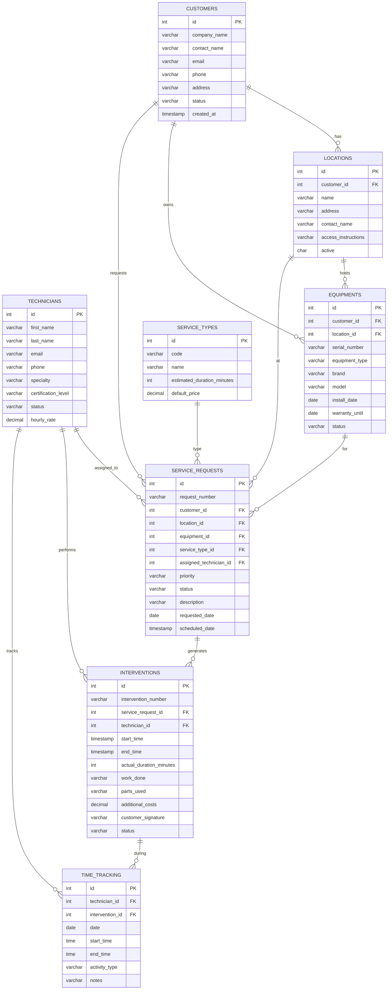

# 📋 Documentation TechServ - User Stories, Personas & Database

> **Use Case** : Système de gestion d'interventions techniques pour PME de maintenance  
> **Contexte** : Modernisation IBM i - Série YouTube "Modern IBM i API Development"

---

## 👥 PERSONAS

### **🔧 Marc Dubois - Technicien Senior HVAC**
**Age** : 35 ans  
**Expérience** : 12 ans dans la maintenance  
**Spécialité** : Climatisation et chauffage industriel

**Profil** :
- Technicien expérimenté avec certification HVAC Expert
- Travaille principalement sur sites clients
- Utilise smartphone Android pour communication
- Préfère interfaces simples et rapides
- Autonome mais a besoin d'infos centralisées

**Frustrations actuelles** :
- ❌ Doit appeler dispatcher pour chaque info
- ❌ Paperasse manuelle à remplir en fin de journée
- ❌ Pas d'accès aux historiques équipements
- ❌ Planning changements non communiqués en temps réel
- ❌ Perte de temps en déplacements inutiles

**Besoins fonctionnels** :
- ✅ Voir planning du jour sur mobile
- ✅ Accéder détails interventions offline
- ✅ Saisir temps et matériel facilement
- ✅ Faire signer client électroniquement
- ✅ Consulter historique équipement avant intervention

**Quote** : *"Si je pouvais avoir toutes les infos sur mon téléphone, je serais 2x plus efficace"*

---

### **📞 Sophie Martin - Dispatching Manager**
**Age** : 42 ans  
**Expérience** : 8 ans chez TechServ  
**Rôle** : Coordination équipes et planning

**Profil** :
- Gère équipe 15 techniciens répartis sur 3 régions
- Interface principale avec clients pour urgences
- Utilise système IBM i legacy (écrans verts 5250)
- Excellente connaissance métier et des techniciens
- Orientée efficacité et satisfaction client

**Frustrations actuelles** :
- ❌ Interface 5250 lente et peu ergonomique
- ❌ Pas de vue temps réel sur interventions
- ❌ Difficile d'optimiser planning géographique
- ❌ Reporting manuel fastidieux pour direction
- ❌ Communication phone-based avec techniciens

**Besoins fonctionnels** :
- ✅ Dashboard temps réel état interventions
- ✅ Planning drag & drop intuitif
- ✅ Alertes automatiques retards/urgences
- ✅ Rapports automatisés clients
- ✅ Vue géographique optimisation trajets

**Quote** : *"J'ai besoin de voir d'un coup d'œil qui est où et pour combien de temps"*

---

### **🏢 Jean-Pierre Moreau - Client PME**
**Age** : 58 ans  
**Poste** : Responsable maintenance - Acme Manufacturing  
**Secteur** : Industrie agro-alimentaire

**Profil** :
- Gère maintenance 3 sites production (150 équipements)
- 50+ équipements sous contrat maintenance TechServ
- Préfère email/téléphone au digital complexe
- Soucieux continuité production et maîtrise coûts
- Relation de confiance établie avec TechServ

**Frustrations actuelles** :
- ❌ Pas de visibilité sur planning interventions
- ❌ Historique maintenance dispersé (papier/Excel)
- ❌ Factures pas assez détaillées
- ❌ Délais validation devis trop longs
- ❌ Pas d'anticipation pannes récurrentes

**Besoins fonctionnels** :
- ✅ Portail web simple suivi interventions
- ✅ Historique maintenance par équipement
- ✅ Notifications proactives maintenance préventive
- ✅ Validation devis en ligne
- ✅ Rapports périodiques automatiques

**Quote** : *"Je veux juste savoir que mes machines sont suivies sans m'occuper des détails"*

---

### **💼 Alain Leclerc - Dirigeant TechServ**
**Age** : 52 ans  
**Poste** : PDG Fondateur  
**Profil** : Entrepreneur, ancien technicien devenu dirigeant

**Vision Business** :
- Croissance contrôlée (15 → 25 techniciens en 2 ans)
- Modernisation progressive sans révolution
- Amélioration marge et satisfaction client
- Différenciation concurrentielle par service

**KPIs Prioritaires** :
- 📊 Taux d'utilisation techniciens (>75%)
- 📈 Délai moyen intervention (<24h urgence, <48h normal)
- 💰 Marge par intervention (>40%)
- 😊 Satisfaction client (NPS >50)
- 💡 Taux de maintenance préventive vs curative

**Quote** : *"Notre IBM i a 20 ans de données métier, je veux les garder mais avoir des outils modernes"*

---

## 📖 USER STORIES

### **🎯 EPIC 1 : Gestion des Techniciens**

#### **US-T001 : Consultation planning mobile**
**En tant que** technicien  
**Je veux** consulter mon planning du jour sur mobile  
**Afin de** connaître mes interventions sans appeler le dispatcher

**Critères d'acceptation** :
- [ ] Interface mobile responsive
- [ ] Planning visible offline (cache local)
- [ ] Détails intervention : client, adresse, type, durée estimée
- [ ] Statut intervention (planifiée, en cours, terminée)
- [ ] Bouton navigation GPS vers adresse client

**Priorité** : 🔴 Critique  
**Story Points** : 8  
**Persona** : Marc Dubois

---

#### **US-T002 : Démarrage intervention**
**En tant que** technicien  
**Je veux** marquer le début d'une intervention  
**Afin de** déclencher le suivi temps automatique

**Critères d'acceptation** :
- [ ] Bouton "Commencer" sur intervention planifiée
- [ ] Capture automatique heure début
- [ ] Changement statut "En cours"
- [ ] Notification dispatcher en temps réel
- [ ] Géolocalisation optionnelle

**Priorité** : 🔴 Critique  
**Story Points** : 5  
**Persona** : Marc Dubois

---

#### **US-T003 : Saisie matériel utilisé**
**En tant que** technicien  
**Je veux** saisir rapidement le matériel utilisé  
**Afin de** faciliter facturation et gestion stock

**Critères d'acceptation** :
- [ ] Liste matériel fréquent (autocomplete)
- [ ] Scan code-barres si disponible
- [ ] Quantité et prix unitaire
- [ ] Photo justificative optionnelle
- [ ] Sauvegarde offline puis sync

**Priorité** : 🟡 Important  
**Story Points** : 13  
**Persona** : Marc Dubois

---

#### **US-T004 : Signature client électronique**
**En tant que** technicien  
**Je veux** faire signer le client électroniquement  
**Afin de** valider la fin d'intervention sans papier

**Critères d'acceptation** :
- [ ] Canvas tactile pour signature
- [ ] Nom client + date/heure automatique
- [ ] Génération PDF rapport intervention
- [ ] Envoi email automatique client
- [ ] Sauvegarde en base avec intervention

**Priorité** : 🟡 Important  
**Story Points** : 21  
**Persona** : Marc Dubois

---

### **🎯 EPIC 2 : Dispatching & Planning**

#### **US-D001 : Dashboard temps réel**
**En tant que** dispatcher  
**Je veux** voir l'état temps réel de toutes les interventions  
**Afin d'** optimiser coordination et répondre aux urgences

**Critères d'acceptation** :
- [ ] Vue d'ensemble : techniciens + statuts interventions
- [ ] Codes couleur : planifié (bleu), en cours (orange), terminé (vert), retard (rouge)
- [ ] Temps écoulé/estimé par intervention
- [ ] Alertes visuelles retards >30min
- [ ] Refresh automatique toutes les 2min

**Priorité** : 🔴 Critique  
**Story Points** : 13  
**Persona** : Sophie Martin

---

#### **US-D002 : Planning drag & drop**
**En tant que** dispatcher  
**Je veux** déplacer interventions par glisser-déposer  
**Afin de** réorganiser planning rapidement

**Critères d'acceptation** :
- [ ] Interface calendrier semaine/jour
- [ ] Drag & drop intervention entre techniciens
- [ ] Drag & drop intervention entre créneaux horaires
- [ ] Validation contraintes (disponibilité, compétences)
- [ ] Notification automatique technicien concerné
- [ ] Historique modifications planning

**Priorité** : 🟡 Important  
**Story Points** : 21  
**Persona** : Sophie Martin

---

#### **US-D003 : Affectation automatique**
**En tant que** dispatcher  
**Je veux** que le système propose l'affectation optimale  
**Afin de** minimiser temps trajet et maximiser utilisation

**Critères d'acceptation** :
- [ ] Algorithme distance géographique
- [ ] Prise en compte spécialités technicien
- [ ] Respect créneaux disponibilité
- [ ] Score optimisation affiché
- [ ] Possibilité override manuel
- [ ] Apprentissage préférences dispatcher

**Priorité** : 🟢 Nice to have  
**Story Points** : 34  
**Persona** : Sophie Martin

---

### **🎯 EPIC 3 : Portail Client**

#### **US-C001 : Suivi interventions**
**En tant que** client  
**Je veux** suivre l'état de mes demandes d'intervention  
**Afin de** planifier mon organisation interne

**Critères d'acceptation** :
- [ ] Liste demandes avec statuts clairs
- [ ] Détails intervention : technicien, horaire prévu/réel
- [ ] Historique communications (emails, notes)
- [ ] Notification changements planning
- [ ] Export PDF rapport intervention

**Priorité** : 🟡 Important  
**Story Points** : 13  
**Persona** : Jean-Pierre Moreau

---

#### **US-C002 : Historique équipements**
**En tant que** client  
**Je veux** consulter l'historique maintenance de mes équipements  
**Afin de** suivre leur état et anticiper remplacements

**Critères d'acceptation** :
- [ ] Liste équipements avec photos
- [ ] Chronologie interventions par équipement
- [ ] Graphiques fréquence pannes
- [ ] Recommandations maintenance préventive
- [ ] Export historique complet

**Priorité** : 🟡 Important  
**Story Points** : 21  
**Persona** : Jean-Pierre Moreau

---

#### **US-C003 : Demande intervention en ligne**
**En tant que** client  
**Je veux** créer une demande d'intervention en ligne  
**Afin de** éviter appels téléphoniques et avoir traçabilité

**Critères d'acceptation** :
- [ ] Formulaire guidé par équipement
- [ ] Upload photos problème
- [ ] Choix priorité et créneau souhaité
- [ ] Confirmation automatique avec n° ticket
- [ ] Estimation délai intervention

**Priorité** : 🟢 Nice to have  
**Story Points** : 21  
**Persona** : Jean-Pierre Moreau

---

### **🎯 EPIC 4 : Reporting & Analytics**

#### **US-R001 : KPI dashboard dirigeant**
**En tant que** dirigeant  
**Je veux** visualiser les KPI business en temps réel  
**Afin de** piloter performance et prendre décisions

**Critères d'acceptation** :
- [ ] Taux utilisation techniciens (% temps facturés)
- [ ] Délai moyen intervention par priorité
- [ ] Marge par intervention et évolution
- [ ] Satisfaction client (sondages post-intervention)
- [ ] Comparaison périodes (mois/trimestre/année)

**Priorité** : 🟡 Important  
**Story Points** : 21  
**Persona** : Alain Leclerc

---

#### **US-R002 : Analyse prédictive pannes**
**En tant que** dirigeant  
**Je veux** identifier équipements à risque de panne  
**Afin de** proposer maintenance préventive clients

**Critères d'acceptation** :
- [ ] Algorithme analyse fréquence pannes par modèle
- [ ] Alertes équipements >X interventions/an
- [ ] Recommandations maintenance préventive
- [ ] ROI maintenance préventive vs curative
- [ ] Rapport commercial maintenance préventive

**Priorité** : 🟢 Nice to have  
**Story Points** : 34  
**Persona** : Alain Leclerc

---

## 🗄️ SCHÉMAS BASE DE DONNÉES

### **📊 Modèle Conceptuel (ERD)**



### **🏗️ Structure Physique IBM i**

#### **Phase 1 : Tables Fondamentales**

**TECHNICIANS** - Techniciens
```sql
CREATE TABLE TECHSERV.TECHNICIANS (
    ID INTEGER NOT NULL GENERATED ALWAYS AS IDENTITY PRIMARY KEY,
    FIRST_NAME VARCHAR(50) NOT NULL,
    LAST_NAME VARCHAR(50) NOT NULL,
    EMAIL VARCHAR(100) NOT NULL UNIQUE,
    PHONE VARCHAR(20),
    SPECIALTY VARCHAR(50), -- HVAC, ELECTRICAL, PLUMBING, GENERAL
    CERTIFICATION_LEVEL VARCHAR(20) DEFAULT 'JUNIOR', -- JUNIOR, SENIOR, EXPERT
    STATUS VARCHAR(20) DEFAULT 'ACTIVE', -- ACTIVE, ON_LEAVE, INACTIVE
    HIRE_DATE DATE,
    HOURLY_RATE DECIMAL(10,2),
    CREATED_AT TIMESTAMP DEFAULT CURRENT_TIMESTAMP,
    UPDATED_AT TIMESTAMP
);

-- Index pour performance
CREATE INDEX IX_TECH_STATUS ON TECHSERV.TECHNICIANS(STATUS);
CREATE INDEX IX_TECH_SPECIALTY ON TECHSERV.TECHNICIANS(SPECIALTY);
```

**CUSTOMERS** - Clients
```sql
CREATE TABLE TECHSERV.CUSTOMERS (
    ID INTEGER NOT NULL GENERATED ALWAYS AS IDENTITY PRIMARY KEY,
    COMPANY_NAME VARCHAR(100) NOT NULL,
    CONTACT_NAME VARCHAR(100),
    EMAIL VARCHAR(100),
    PHONE VARCHAR(20) NOT NULL,
    MOBILE VARCHAR(20),
    ADDRESS VARCHAR(200),
    CITY VARCHAR(50),
    POSTAL_CODE VARCHAR(10),
    COUNTRY VARCHAR(50) DEFAULT 'FR',
    STATUS VARCHAR(20) DEFAULT 'PROSPECT', -- PROSPECT, ACTIVE, SUSPENDED, INACTIVE
    PAYMENT_TERMS INTEGER DEFAULT 30,
    CREATED_AT TIMESTAMP DEFAULT CURRENT_TIMESTAMP,
    UPDATED_AT TIMESTAMP
);

CREATE INDEX IX_CUST_STATUS ON TECHSERV.CUSTOMERS(STATUS);
CREATE INDEX IX_CUST_COMPANY ON TECHSERV.CUSTOMERS(COMPANY_NAME);
```

**SERVICE_TYPES** - Types d'interventions
```sql
CREATE TABLE TECHSERV.SERVICE_TYPES (
    ID INTEGER NOT NULL GENERATED ALWAYS AS IDENTITY PRIMARY KEY,
    CODE VARCHAR(20) NOT NULL UNIQUE,
    NAME VARCHAR(100) NOT NULL,
    DESCRIPTION VARCHAR(500),
    ESTIMATED_DURATION_MINUTES INTEGER DEFAULT 60,
    DEFAULT_PRICE DECIMAL(10,2),
    ACTIVE CHAR(1) DEFAULT 'Y',
    CREATED_AT TIMESTAMP DEFAULT CURRENT_TIMESTAMP
);

-- Données de référence
INSERT INTO TECHSERV.SERVICE_TYPES (CODE, NAME, ESTIMATED_DURATION_MINUTES, DEFAULT_PRICE) VALUES
    ('HVAC-MAINT', 'HVAC Maintenance Routine', 120, 150.00),
    ('HVAC-REPAIR', 'HVAC Emergency Repair', 180, 250.00),
    ('HVAC-INSTALL', 'HVAC Installation', 480, 800.00),
    ('ELEC-INSTALL', 'Electrical Installation', 240, 300.00),
    ('ELEC-REPAIR', 'Electrical Repair', 120, 180.00),
    ('PLUMB-REPAIR', 'Plumbing Repair', 90, 120.00),
    ('PLUMB-INSTALL', 'Plumbing Installation', 180, 200.00),
    ('GEN-MAINT', 'General Maintenance', 60, 80.00);
```

#### **Phase 2 : Relations & Complexité**

**LOCATIONS** - Sites clients
```sql
CREATE TABLE TECHSERV.LOCATIONS (
    ID INTEGER NOT NULL GENERATED ALWAYS AS IDENTITY PRIMARY KEY,
    CUSTOMER_ID INTEGER NOT NULL,
    NAME VARCHAR(100) NOT NULL,
    ADDRESS VARCHAR(200) NOT NULL,
    CITY VARCHAR(50),
    POSTAL_CODE VARCHAR(10),
    CONTACT_NAME VARCHAR(100),
    CONTACT_PHONE VARCHAR(20),
    ACCESS_INSTRUCTIONS VARCHAR(500),
    ACTIVE CHAR(1) DEFAULT 'Y',
    CREATED_AT TIMESTAMP DEFAULT CURRENT_TIMESTAMP,
    
    CONSTRAINT FK_LOC_CUSTOMER FOREIGN KEY (CUSTOMER_ID) 
        REFERENCES TECHSERV.CUSTOMERS(ID)
);

CREATE INDEX IX_LOC_CUSTOMER ON TECHSERV.LOCATIONS(CUSTOMER_ID);
```

**EQUIPMENTS** - Équipements
```sql
CREATE TABLE TECHSERV.EQUIPMENTS (
    ID INTEGER NOT NULL GENERATED ALWAYS AS IDENTITY PRIMARY KEY,
    CUSTOMER_ID INTEGER NOT NULL,
    LOCATION_ID INTEGER,
    SERIAL_NUMBER VARCHAR(50) NOT NULL UNIQUE,
    EQUIPMENT_TYPE VARCHAR(50), -- HVAC, BOILER, GENERATOR, ELECTRICAL_PANEL
    BRAND VARCHAR(50),
    MODEL VARCHAR(100),
    INSTALL_DATE DATE,
    WARRANTY_UNTIL DATE,
    LAST_MAINTENANCE_DATE DATE,
    STATUS VARCHAR(20) DEFAULT 'OPERATIONAL', -- OPERATIONAL, MAINTENANCE, BROKEN, RETIRED
    NOTES VARCHAR(1000),
    CREATED_AT TIMESTAMP DEFAULT CURRENT_TIMESTAMP,
    
    CONSTRAINT FK_EQP_CUSTOMER FOREIGN KEY (CUSTOMER_ID) 
        REFERENCES TECHSERV.CUSTOMERS(ID),
    CONSTRAINT FK_EQP_LOCATION FOREIGN KEY (LOCATION_ID) 
        REFERENCES TECHSERV.LOCATIONS(ID)
);

CREATE INDEX IX_EQP_CUSTOMER ON TECHSERV.EQUIPMENTS(CUSTOMER_ID);
CREATE INDEX IX_EQP_LOCATION ON TECHSERV.EQUIPMENTS(LOCATION_ID);
CREATE INDEX IX_EQP_STATUS ON TECHSERV.EQUIPMENTS(STATUS);
CREATE INDEX IX_EQP_TYPE ON TECHSERV.EQUIPMENTS(EQUIPMENT_TYPE);
```

#### **Phase 3 : Workflow Business**

**SERVICE_REQUESTS** - Demandes d'intervention
```sql
CREATE TABLE TECHSERV.SERVICE_REQUESTS (
    ID INTEGER NOT NULL GENERATED ALWAYS AS IDENTITY PRIMARY KEY,
    REQUEST_NUMBER VARCHAR(20) NOT NULL UNIQUE,
    CUSTOMER_ID INTEGER NOT NULL,
    LOCATION_ID INTEGER,
    EQUIPMENT_ID INTEGER,
    SERVICE_TYPE_ID INTEGER,
    ASSIGNED_TECHNICIAN_ID INTEGER,
    PRIORITY VARCHAR(20) DEFAULT 'NORMAL', -- LOW, NORMAL, HIGH, URGENT
    STATUS VARCHAR(20) DEFAULT 'PENDING', -- PENDING, SCHEDULED, IN_PROGRESS, COMPLETED, CANCELLED
    DESCRIPTION VARCHAR(1000) NOT NULL,
    REPORTED_BY VARCHAR(100),
    REPORTED_AT TIMESTAMP DEFAULT CURRENT_TIMESTAMP,
    REQUESTED_DATE DATE,
    SCHEDULED_DATE TIMESTAMP,
    ESTIMATED_DURATION_MINUTES INTEGER,
    CREATED_AT TIMESTAMP DEFAULT CURRENT_TIMESTAMP,
    UPDATED_AT TIMESTAMP,
    
    CONSTRAINT FK_SR_CUSTOMER FOREIGN KEY (CUSTOMER_ID) 
        REFERENCES TECHSERV.CUSTOMERS(ID),
    CONSTRAINT FK_SR_LOCATION FOREIGN KEY (LOCATION_ID) 
        REFERENCES TECHSERV.LOCATIONS(ID),
    CONSTRAINT FK_SR_EQUIPMENT FOREIGN KEY (EQUIPMENT_ID) 
        REFERENCES TECHSERV.EQUIPMENTS(ID),
    CONSTRAINT FK_SR_SERVICE_TYPE FOREIGN KEY (SERVICE_TYPE_ID) 
        REFERENCES TECHSERV.SERVICE_TYPES(ID),
    CONSTRAINT FK_SR_TECHNICIAN FOREIGN KEY (ASSIGNED_TECHNICIAN_ID) 
        REFERENCES TECHSERV.TECHNICIANS(ID)
);

-- Index pour performance requêtes fréquentes
CREATE INDEX IX_SR_STATUS ON TECHSERV.SERVICE_REQUESTS(STATUS);
CREATE INDEX IX_SR_PRIORITY ON TECHSERV.SERVICE_REQUESTS(PRIORITY);
CREATE INDEX IX_SR_TECHNICIAN ON TECHSERV.SERVICE_REQUESTS(ASSIGNED_TECHNICIAN_ID);
CREATE INDEX IX_SR_CUSTOMER ON TECHSERV.SERVICE_REQUESTS(CUSTOMER_ID);
CREATE INDEX IX_SR_SCHEDULED ON TECHSERV.SERVICE_REQUESTS(SCHEDULED_DATE);
```

**INTERVENTIONS** - Travail réalisé
```sql
CREATE TABLE TECHSERV.INTERVENTIONS (
    ID INTEGER NOT NULL GENERATED ALWAYS AS IDENTITY PRIMARY KEY,
    INTERVENTION_NUMBER VARCHAR(20) NOT NULL UNIQUE,
    SERVICE_REQUEST_ID INTEGER NOT NULL,
    TECHNICIAN_ID INTEGER NOT NULL,
    START_TIME TIMESTAMP NOT NULL,
    END_TIME TIMESTAMP,
    ACTUAL_DURATION_MINUTES INTEGER GENERATED ALWAYS AS (
        CASE 
            WHEN END_TIME IS NOT NULL 
            THEN TIMESTAMPDIFF(8, CHAR(END_TIME - START_TIME))
            ELSE NULL 
        END
    ),
    TRAVEL_TIME_MINUTES INTEGER DEFAULT 0,
    WORK_DONE VARCHAR(2000),
    PARTS_USED VARCHAR(2000), -- JSON format
    ADDITIONAL_COSTS DECIMAL(10,2) DEFAULT 0,
    TECHNICIAN_NOTES VARCHAR(1000),
    CUSTOMER_SIGNATURE VARCHAR(100),
    SIGNATURE_DATE TIMESTAMP,
    STATUS VARCHAR(20) DEFAULT 'IN_PROGRESS', -- IN_PROGRESS, COMPLETED, CANCELLED
    CREATED_AT TIMESTAMP DEFAULT CURRENT_TIMESTAMP,
    
    CONSTRAINT FK_INT_SERVICE_REQUEST FOREIGN KEY (SERVICE_REQUEST_ID) 
        REFERENCES TECHSERV.SERVICE_REQUESTS(ID),
    CONSTRAINT FK_INT_TECHNICIAN FOREIGN KEY (TECHNICIAN_ID) 
        REFERENCES TECHSERV.TECHNICIANS(ID)
);

CREATE INDEX IX_INT_STATUS ON TECHSERV.INTERVENTIONS(STATUS);
CREATE INDEX IX_INT_TECHNICIAN ON TECHSERV.INTERVENTIONS(TECHNICIAN_ID);
CREATE INDEX IX_INT_START_TIME ON TECHSERV.INTERVENTIONS(START_TIME);
```

### **🔄 Workflow États**

#### **SERVICE_REQUESTS Status Flow**
```
PENDING → SCHEDULED → IN_PROGRESS → COMPLETED
    ↓           ↓           ↓
 CANCELLED   CANCELLED   CANCELLED
```

#### **INTERVENTIONS Status Flow**
```
IN_PROGRESS → COMPLETED
     ↓
  CANCELLED
```

#### **Règles Business**
- Service Request ne peut être SCHEDULED que si technician_id assigné
- Intervention créée automatiquement quand Service Request passe IN_PROGRESS
- Service Request passe COMPLETED quand dernière Intervention COMPLETED
- Calculs automatiques : duration, labor_cost, total_cost

---

## 📊 MÉTRIQUES & KPI

### **📈 KPI Opérationnels**

#### **Techniciens**
- **Taux d'utilisation** : `(temps_facturé / temps_travaillé) * 100`
- **Interventions/jour** : Moyenne par technicien
- **Temps moyen/intervention** : Par type service
- **Taux satisfaction** : Note client post-intervention

#### **Planning**
- **Délai moyen intervention** : De création à début réalisation
- **Taux respect planning** : Interventions à l'heure vs retard
- **Taux annulation** : Annulations/total demandes
- **Distance moyenne** : Km par technicien/jour

#### **Business**
- **Chiffre d'affaires/technicien/mois**
- **Marge par intervention** : (Prix - Coût) / Prix
- **Évolution contrats maintenance** : Préventif vs curatif
- **NPS Client** : Net Promoter Score

### **📊 Requêtes Analytics Clés**

#### **Dashboard Dispatcher**
```sql
-- Vue temps réel interventions en cours
SELECT 
    t.first_name + ' ' + t.last_name as technician,
    i.intervention_number,
    c.company_name,
    i.start_time,
    TIMESTAMPDIFF(8, CHAR(CURRENT_TIMESTAMP - i.start_time)) as duration_minutes,
    sr.priority,
    sr.estimated_duration_minutes
FROM interventions i
JOIN technicians t ON i.technician_id = t.id
JOIN service_requests sr ON i.service_request_id = sr.id  
JOIN customers c ON sr.customer_id = c.id
WHERE i.status = 'IN_PROGRESS'
ORDER BY i.start_time;
```

#### **KPI Utilisation Techniciens**
```sql
-- Taux utilisation par technicien (dernier mois)
SELECT 
    t.first_name + ' ' + t.last_name as technician,
    COUNT(i.id) as interventions_count,
    SUM(i.actual_duration_minutes) as minutes_worked,
    AVG(i.actual_duration_minutes) as avg_duration,
    SUM(i.actual_duration_minutes * t.hourly_rate / 60) as revenue_generated
FROM technicians t
LEFT JOIN interventions i ON t.id = i.technician_id 
    AND i.start_time >= CURRENT_DATE - 30 DAYS
    AND i.status = 'COMPLETED'
WHERE t.status = 'ACTIVE'
GROUP BY t.id, t.first_name, t.last_name, t.hourly_rate
ORDER BY revenue_generated DESC;
```

#### **Analyse Équipements à Risque**
```sql
-- Équipements avec >3 interventions dans les 6 derniers mois
SELECT 
    e.serial_number,
    e.equipment_type,
    e.brand,
    e.model,
    c.company_name,
    COUNT(i.id) as intervention_count,
    MAX(i.start_time) as last_intervention,
    AVG(TIMESTAMPDIFF(8, CHAR(i.end_time - i.start_time))) as avg_duration
FROM equipments e
JOIN customers c ON e.customer_id = c.id
JOIN service_requests sr ON e.id = sr.equipment_id
JOIN interventions i ON sr.id = i.service_request_id
WHERE i.start_time >= CURRENT_DATE - 180 DAYS
    AND i.status = 'COMPLETED'
GROUP BY e.id, e.serial_number, e.equipment_type, e.brand, e.model, c.company_name
HAVING COUNT(i.id) > 3
ORDER BY intervention_count DESC, last_intervention DESC;
```

---

## 🎯 PRIORISATION & ROADMAP

### **🚀 MVP (Minimum Viable Product)**
**Objectif** : Validation concept avec fonctionnalités essentielles

#### **Sprint 1-2 : Fondations (4 semaines)**
- [ ] API Technicians CRUD complète
- [ ] API Service Types (référentiel)
- [ ] API Customers CRUD
- [ ] Tests automatisés pattern REST
- [ ] Documentation API (Swagger/OpenAPI)

#### **Sprint 3-4 : Relations (4 semaines)**  
- [ ] API Locations (N-1 Customer)
- [ ] API Equipments (N-1 Customer, N-1 Location)
- [ ] API Service Requests (workflow basique)
- [ ] Interface web dispatcher (React-Admin)

#### **Sprint 5-6 : Workflow (4 semaines)**
- [ ] API Interventions (business complexe)
- [ ] Gestion états Service Requests
- [ ] Dashboard temps réel basique
- [ ] App mobile technicien (MVP)

### **🌟 Version 1.0 (Production)**
**Objectif** : Système complet utilisable quotidiennement

#### **Sprint 7-8 : UX/UI (4 semaines)**
- [ ] Interface dispatcher complète
- [ ] App mobile technicien full features
- [ ] Portail client consultation
- [ ] Notifications temps réel

#### **Sprint 9-10 : Analytics (4 semaines)**
- [ ] Dashboard KPI dirigeant
- [ ] Rapports automatisés
- [ ] Alertes business (retards, pannes récurrentes)
- [ ] Export données (PDF, Excel)

### **🚀 Version 2.0 (Optimisation)**
**Objectif** : Intelligence artificielle et optimisation

#### **Future Features**
- [ ] Planning automatique optimisé (AI)
- [ ] Maintenance prédictive (ML)
- [ ] Reconnaissance vocale saisie
- [ ] IoT intégration équipements
- [ ] Facturation automatique

---

## 📝 CONCLUSION

Cette documentation fournit une base solide pour le développement du système TechServ, avec :

- **4 personas** représentatifs des utilisateurs types
- **20+ user stories** détaillées avec critères d'acceptation
- **Modèle de données** progressif et évolutif
- **Métriques KPI** orientées business
- **Roadmap** réaliste étalée sur 6 mois

L'approche **API REST d'abord** permet de valider les patterns avant implémentation du générateur CMagic, tout en créant un système fonctionnel pour la série YouTube "Modern IBM i API Development".

**Next Steps** :
1. Validation personas avec experts métier
2. Priorisation user stories avec product owner
3. Setup environnement développement
4. Démarrage Sprint 1 : API Technicians

---
*Document vivant - Version 1.0 - Novembre 2025*