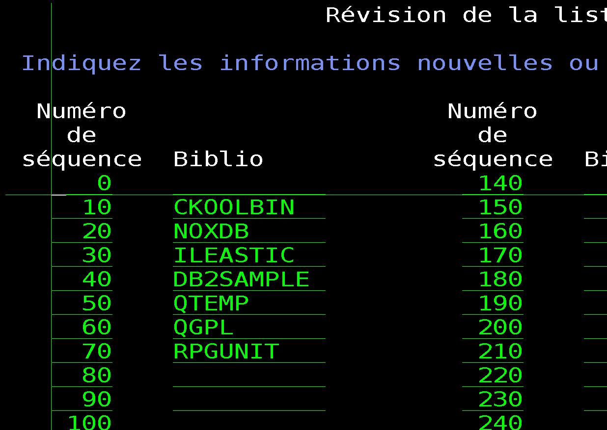
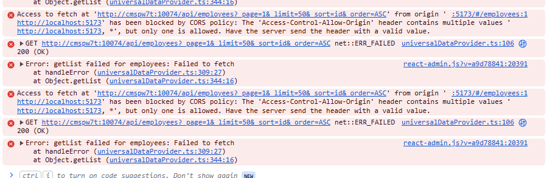

# 🚀 Modern IBM i API Development - ApplicationTemplate

> **Template & Learning Repository** pour la modernisation IBM i avec APIs REST
> 🎬 **Projet TechServ** : Série YouTube "Modern IBM i API Development"

## 📖 À Propos

Ce repository contient :

### **🎯 Template Production-Ready**

- ✅ **Patterns API REST** validés avec ILEastic
- ✅ **Structure modulaire** réutilisable
- ✅ **Standards modernes** compatibles React-Admin/Appsmith/Retool
- ✅ **Build automation** avec BOB

### **🎬 Projet TechServ - Série YouTube**

- 📺 **20 épisodes** de développement API en direct
- 🏢 **Use case réel** : PME maintenance technique
- 🎓 **Pédagogie complète** : du CRUD aux APIs complexes
- 🌟 **Open Source** : code disponible pour tous

### **🔮 Vision Future : Générateur CMagic**

- 🎨 **DSL** pour génération automatique d'APIs
- ⚡ **Patterns CUA** (CREATE, UPDATE, DELETE, DISPLAY, WORK_WITH)
- 🔄 **Workflow** par statuts (State Machine)
- 🏗️ **Architecture** Entity as Object

## 🏢 TechServ - Use Case Série YouTube

**TechServ** est une PME spécialisée dans la maintenance technique qui modernise son système IBM i :

### **Problématique**

- ❌ Interface 5250 peu ergonomique
- ❌ Pas d'accès mobile pour techniciens terrain
- ❌ Impossibilité d'intégrer outils modernes
- ❌ Difficulté recrutement développeurs RPG

### **Solution**

- ✅ APIs REST sur données IBM i existantes
- ✅ Dashboard React-Admin pour dispatcher
- ✅ App mobile pour techniciens
- ✅ Zéro migration de données

### **Architecture**

```
Mobile + React-Admin → APIs REST (ILEastic) → IBM i (RPG + DB2)
```

## 📺 Série YouTube - 20 Épisodes

### **🌟 Saison 1 : Fondations (1-6)**

1. **Introduction - Building TechServ Together** *(12-15 min)*
2. **Your First API - Technicians CRUD** *(25-30 min)*
3. **Reference Data Made Easy - Service Types** *(15-20 min)*
4. **Business Entity - Customers with Validation** *(30-35 min)*
5. **Testing Like a Pro - Automation & Quality** *(20-25 min)*
6. **First Frontend - React Admin Setup** *(30-35 min)*

### **🔗 Saison 2 : Relations & Workflow (7-12)**

7. **Relations 101 - Locations & Equipments** *(30 min)*
8. **The Core - Service Requests Entity** *(35-40 min)*
9. **Workflow Magic - Status State Machine** *(30-35 min)*
10. **Real Work - Interventions & Time Tracking** *(35 min)*
11. **Dashboard Power - Analytics & Reporting** *(30 min)*
12. **Mobile First - Technician App Concept** *(25-30 min)*

### **🚀 Saison 3 : Production Ready (13-16)**

### **🎨 Saison 4 : Code Generation (17-20)**

**[➡️ Voir planning complet](PROJET_TECHSERV_YOUTUBE.md)**

## 🛠️ Installation & Setup

### **Prérequis**

- IBM i 7.3+ avec BOB (Build automation)
- ILEastic framework installé
- Git configuré
- Accès SQL (création tables)

### Structure du projet

Le projet est organisé de la manière suivante :
par composants et par type de code (source, test, lib).

```
.
├── Makefile
├── README.md
├── src
│   ├── employee
│   │   ├── analyse.sql
│   │   ├── employee.bnd
│   │   ├── employee.jdl
│   │   ├── employee.sqlrpgle
│   │   ├── invemp.dspf
│   │   ├── invemp.pgm.sqlrpgle
│   │   ├── Rules.mk
│   │   ├── tstwrkemp.sqlrpgle
│   │   ├── wrkemp.dspf
│   │   └── wrkemp.pgm.sqlrpgle
│   └── inventory
│       ├── analyse.sql
```

potentiellement les tests unitaires et les règles de gestion sont dans le même répertoire que le code source.
j'attends de bien faire marcher la nouvel extension pour ce faire.pour l'instant les lancements de tests unitaires et de règles de gestion sont dans le répertoire `tests` avec un makefile particulier.
Toues les fichiers d'includes sont dans le répertoire `includes` et les fichiers de configuration dans le répertoire `config`.

### Exemple de structure du dossier `includes`

Le dossier `includes` contient les fichiers d'inclusion nécessaires pour les programmes RPG. Par exemple :

```
includes

├── cmagic.rpgleinc
└── employee.rpgleinc
```

Chaque fichier `.rpgleinc` contient des définitions ou prototypes réutilisables dans plusieurs modules RPG.
les autres fichiers d'includes sont dans le répertoire `/usr/local/include` sur le système de build.
mais la priorité est donné pour la compilation aux includes présents dans le répertoire `includes` du projet.

```
/usr/local/include
├── ckool.rpgleinc
├── ...
└── global.rpgleinc
```

la référence aux includes sont directement intégrés à la compilation via le fichier de configuration `iproj.json` dans la section `includePath` :

```json
{
  "includePath": [
    "includes",
    "/usr/local/include"
  ]
}
```

## utilisation sur l'iBmi.

- mise en place env

```shell
addlible ckoolbin 
addlible DB2SAMPLE
addlible RPGUNIT *last
```

- lancement des tests unitaires

```shell
RUCALLTST TSTPGM(CKOOLTST/EMPLOYEE)
```

- lancement de la gestion des employes.

```shell
call wrkemp
```


- lancement des srvices web

ttt

```shell
call srvweb
```

ADDLIBLE ILEASTIC
SBMJOB CMD(CALL PGM(GESTEMP))
 JOB(GESTEMP) JOBQ(QSYSNOMAX) ALWMLTTHD(*YES)

```

```

 curl -v 'http://localhost:44000/api/employees/000050'
 curl -v 'http://localhost:44000/api/employees?page=1&perPage=5&sort=firstnme&order=ASC'
 curl -v 'http://localhost:44000/api/employees?page=1&perPage=5&sort=workdept,firstnme&order=ASC'

```


```

gg


