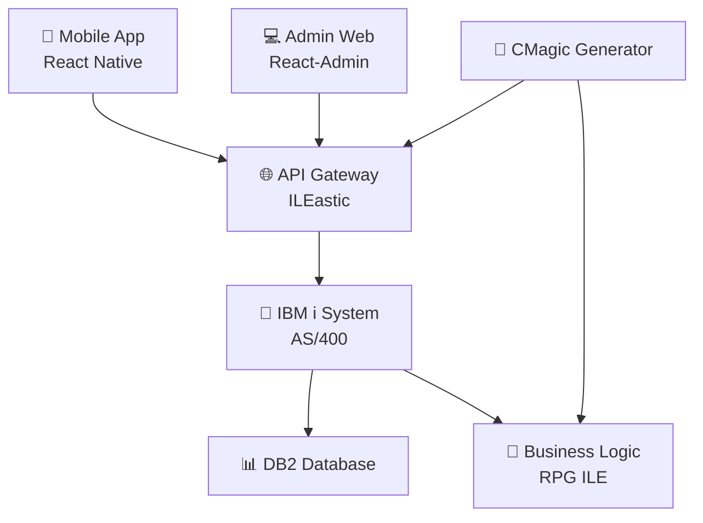

# 🎬 Stratégie Demo Episode 1 - TechServ YouTube Series

## 🎯 CONCEPT : Demo "Vision" plutôt que Complète

### ❌ Éviter la Demo Complète Réelle

**Problèmes identifiés** :
- Nécessite 4-6 mois de développement avant Episode 1
- Retarde énormément le lancement de la série
- Risque de perfectionnisme paralysant
- Perte de momentum et motivation audience

### ✅ Solution Recommandée : Demo "Teaser Vision"

**Principe** : Montrer la destination finale avec des mockups/wireframes plutôt qu'une application complète.

---

## 🎬 Structure Episode 1 : "Introduction - Building TechServ Together"

**📅 Durée** : 12-15 minutes

### **Séquence Détaillée** :

#### **1. Hook (1 min)**
- Problématique IBM i modernization
- "Et si on construisait ensemble une app moderne ?"

#### **2. Vision Demo (5 min)**
- **Wireframes interfaces** (React-Admin + Mobile)
- **Architecture technique** (schémas)
- **Use cases narratifs** (personas)
- **Code samples preview** (extraits finaux)

#### **3. Journey Map (3 min)**
- Plan des 20 épisodes
- Progression étape par étape
- Milestones techniques

#### **4. Setup Initial (3 min)**
- Repository structure
- Outils nécessaires
- Prérequis techniques

#### **5. Call-to-Action (1 min)**
- Subscribe, Star repo
- Feedback communauté
- Annonce Episode 2

---

## 🎨 Assets Visuels à Créer

### **Wireframes TechServ (Figma - 3-4h)**

#### **React-Admin Dashboard**
```
┌─────────────────────────────────────────────────────┐
│ 🏢 TechServ Admin Dashboard                         │
├─────────────────────────────────────────────────────┤
│                                                     │
│ 📊 Today's Overview                                 │
│ ┌─────────────┬─────────────┬─────────────────────┐ │
│ │ 🔧 Active   │ 👨‍🔧 Techs   │ ⚠️ Urgent          │ │
│ │ Requests    │ Available   │ Interventions       │ │
│ │     15      │      8      │         3           │ │
│ └─────────────┴─────────────┴─────────────────────┘ │
│                                                     │
│ 📋 Service Requests                                 │
│ ┌──────────────────────────────────────────────────┐│
│ │ ID  │ Client        │ Type      │ Status │ Tech  ││
│ │ 001 │ Acme Corp     │ HVAC      │ Open   │ Jean  ││
│ │ 002 │ Tech Inc      │ Electric  │ Progress│ Marie ││
│ │ 003 │ Global Ltd    │ Plumbing  │ Urgent │ -     ││
│ └──────────────────────────────────────────────────┘│
│                                                     │
│ [+ New Request] [Assign Tech] [View Calendar]       │
└─────────────────────────────────────────────────────┘
```

#### **Mobile App Technician**
```
┌─────────────────────┐
│ 📱 TechServ Mobile  │
├─────────────────────┤
│                     │
│ 👨‍🔧 Jean Dupont     │
│ Status: Available   │
│                     │
│ 📋 My Interventions │
│ ┌─────────────────┐ │
│ │ 🔧 HVAC Repair  │ │
│ │ Acme Corp       │ │
│ │ 📍 Downtown     │ │
│ │ ⏰ 14:00        │ │
│ │ ⚠️ URGENT       │ │
│ │ [START] [INFO]  │ │
│ └─────────────────┘ │
│                     │
│ ┌─────────────────┐ │
│ │ 🔌 Electrical   │ │
│ │ Tech Industries │ │
│ │ 📍 North Zone   │ │
│ │ ⏰ 16:30        │ │
│ │ 🔵 Normal       │ │
│ │ [SCHEDULE]      │ │
│ └─────────────────┘ │
│                     │
│ [📞 Call] [📍 GPS]  │
└─────────────────────┘
```

### **Architecture Technique (Slides)**



---

## 📝 Script Demo Teaser (5 minutes)

### **Séquence Narrative**

#### **[Screen: Architecture Slide]**
> "Voici l'architecture moderne que nous allons construire ensemble sur IBM i. 
> Une stack complète : React-Admin pour les dispatchers, mobile pour les techniciens, 
> et des APIs REST natives IBM i avec ILEastic."

#### **[Screen: Wireframe React-Admin]**
> "Imaginez Sarah, notre dispatcher. Elle ouvre son interface moderne.
> D'un coup d'œil : 15 demandes d'intervention aujourd'hui, 8 techniciens disponibles, 
> 3 interventions urgentes. Tout en temps réel depuis IBM i."

#### **[Screen: Wireframe Mobile]**
> "Pendant ce temps, Jean, notre technicien HVAC, consulte ses interventions 
> sur son mobile. Réparation urgente chez Acme Corp à 14h00. 
> Il tape 'START' et l'intervention se lance."

#### **[Screen: API Preview]**
```json
GET /api/service-requests
{
  "data": [
    {
      "id": "SR001",
      "client": "Acme Corp",
      "type": "HVAC",
      "status": "OPEN",
      "priority": "URGENT",
      "technician": "Jean Dupont",
      "scheduled": "2025-11-20T14:00:00Z"
    }
  ],
  "total": 15
}
```
> "Derrière ces interfaces : nos APIs REST IBM i standard. 
> GET /api/service-requests retourne du JSON propre, 
> compatible React-Admin, Appsmith, Retool..."

#### **[Screen: Code CMagic Preview]**
```dsl
entity ServiceRequest {
  id: string primary
  client: string required
  type: enum(HVAC, ELECTRIC, PLUMBING)
  status: enum(OPEN, IN_PROGRESS, COMPLETED)
  priority: enum(LOW, NORMAL, URGENT)
  technician: reference(Technician)
  
  actions {
    assign(technicianId)
    start()
    complete(notes)
  }
}
```
> "Et à terme, tout ça généré depuis notre DSL CMagic.
> Une entité = APIs complètes + interfaces + logique métier."

#### **[Screen: Journey Map]**
> "Pour y arriver : 20 épisodes progressifs.
> Nous commençons par les APIs de base, puis React-Admin, 
> puis mobile, et enfin le générateur CMagic."

---

## 🗓️ Evolution Demo Série

| Episode | Demo Level | Contenu |
|---------|------------|---------|
| **Episode 1** | Vision Mockups | Wireframes + Architecture |
| **Episode 6** | Basic Functional | React-Admin + API Technicians |
| **Episode 12** | Mobile Prototype | App mobile basique |
| **Episode 16** | Système Complet | Production ready |
| **Episode 20** | CMagic Demo | Génération automatique |

---

## 📅 Plan Action Immédiat

### **Semaine 1 : Préparation Episode 1**
- [ ] **Wireframes TechServ** (Figma 3-4h)
  - Interface React-Admin
  - Mobile app screens
  - User flow principal
- [ ] **Slides Architecture** (PowerPoint 2h)
  - Stack technique
  - Data flow
  - Composants système
- [ ] **Script Demo** (1h)
  - Narrative use cases
  - Transitions fluides
- [ ] **Repository Setup**
  - Structure initiale
  - README série
  - Issues roadmap
- [ ] **Assets Visuels**
  - Logo TechServ
  - Thumbnails YouTube
  - Branding cohérent

### **Semaine 2 : Production Episode 1**
- [ ] **Enregistrement** (avec wireframes)
- [ ] **Montage vidéo**
- [ ] **Publication YouTube**
- [ ] **Parallèle** : Développer API Technicians (Episode 2)

---

## ✅ Avantages Stratégie "Vision Demo"

### **🚀 Lancement Rapide**
- **2 semaines** vs 4-6 mois développement complet
- Audience engagée dès le début
- Momentum préservé

### **📈 Engagement Communauté**
- Vision claire de la destination
- Participation au journey de construction
- Feedback intégrable en temps réel

### **🔄 Flexibilité Maximale**
- Adaptation selon retours audience
- Pivots techniques possibles
- Évolution organique du projet

### **✨ Authenticité Préservée**
- "Learning in public" genuine
- Erreurs et découvertes partagées
- Communauté = co-créateurs

---

## 🎯 Objectifs Episode 1

### **Métriques Succès**
- **100+ vues** première semaine
- **10+ stars** repository GitHub
- **5+ commentaires** constructifs
- **2+ subscribers** chaîne

### **Call-to-Action Clairs**
1. **Subscribe** chaîne YouTube
2. **Star** repository GitHub
3. **Comment** use cases additionnels
4. **Follow** progression épisodes

### **Setup Tracking**
- Analytics YouTube activées
- GitHub insights monitoring
- Community feedback centralisé

---

**🎬 Prêt pour le lancement de la série TechServ ! 🚀**