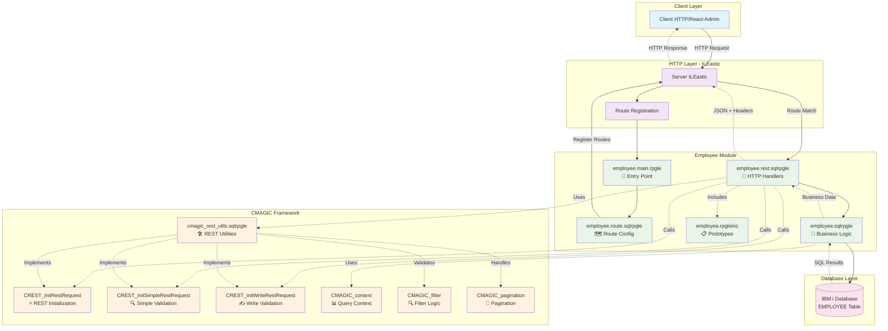

# Architecture CMAGIC - Employee REST API

## 📊 Vue d'Ensemble Architecturale

Ce document présente l'architecture modulaire du projet ArchiAPI, illustrant les interactions entre le framework CMAGIC, le module Employee et la couche REST.

## 🏗️ Diagramme d'Architecture



## 🎯 Couches de l'Architecture

### 1. **Client Layer** 🌐
- **Rôle** : Applications front-end consommatrices de l'API
- **Technologies** : React-Admin, Appsmith, Retool, clients HTTP génériques
- **Communication** : Requêtes HTTP REST standardisées

### 2. **HTTP Layer - ILEastic** 🚀
- **Composants** :
  - **Server ILEastic** : Serveur HTTP IBM i
  - **Route Registration** : Enregistrement et matching des routes
- **Responsabilités** :
  - Gestion des connexions HTTP
  - Routage des requêtes vers les handlers appropriés
  - Gestion CORS et headers HTTP

### 3. **Employee Module** 👥
Structure modulaire complète pour la ressource Employee :

#### **employee.main.rpgle** 📍
```rpg
// Point d'entrée principal
// Configuration serveur ILEastic
// Enregistrement des routes
```

#### **employee.route.sqlrpgle** 🗺️
```rpg
// Configuration des routes REST
il_addRoute(router : %addr(employee_getCollection) : IL_GET : '/api/employee');
il_addRoute(router : %addr(employee_getItem) : IL_GET : '/api/employee/:id');
il_addRoute(router : %addr(employee_create) : IL_POST : '/api/employee');
il_addRoute(router : %addr(employee_update) : IL_PUT : '/api/employee/:id');
il_addRoute(router : %addr(employee_delete) : IL_DELETE : '/api/employee/:id');
```

#### **employee.rest.sqlrpgle** 🔄
```rpg
// Handlers HTTP avec initialisation REST centralisée
// Nouvelle approche : CREST_initRestRequest pour collections
// CREST_initSimpleRestRequest pour accès simples
// CREST_initWriteRestRequest pour POST/PUT
// Génération des réponses JSON standardisée
// Gestion automatique des headers (X-Total-Count, CORS)
```

#### **employee.sqlrpgle** 💼
```rpg
// Logique métier pure
// Requêtes SQL optimisées
// Validation des données
// Gestion des erreurs business
```

#### **employee.rpgleinc** 📋
```rpg
// Prototypes des procédures
// Structures de données
// Templates et interfaces
```

### 4. **CMAGIC Framework** ⚡
Framework transversal fournissant des utilitaires réutilisables :

#### **cmagic_rest_utils.sqlrpgle** 🛠️
```rpg
// Module d'implémentation des utilitaires REST
// Fonctions utilitaires REST centralisées
// Validation des paramètres HTTP standardisée
// Génération JSON standardisée
// Gestion des headers HTTP uniformisée
```

#### **Nouvelles Procédures d'Initialisation REST** ⚡

##### **CREST_initRestRequest** - Collections avec Filtres
```rpg
// Initialisation complète pour collections
// 1. Validation Accept header (JSON requis)
// 2. Parsing centralisé des paramètres REST
// Usage : GET /api/employees avec pagination/filtres
dcl-pr CREST_initRestRequest ind export;
  request likeds(IL_request) const;
  response likeds(IL_response);
  supportedFields pointer const options(*nopass);
  context likeDS(CMAGIC_context);
end-pr;
```

##### **CREST_initSimpleRestRequest** - Accès Simple
```rpg
// Validation basique pour accès simples
// 1. Validation Accept header uniquement
// Usage : GET /api/employees/{id}
dcl-pr CREST_initSimpleRestRequest ind export;
  request likeds(IL_request) const;
  response likeds(IL_response);
end-pr;
```

##### **CREST_initWriteRestRequest** - Opérations d'Écriture
```rpg
// Validation pour opérations de modification
// 1. Validation Content-Type header (JSON requis)
// Usage : POST/PUT avec payload JSON
dcl-pr CREST_initWriteRestRequest ind export;
  request likeds(IL_request) const;
  response likeds(IL_response);
end-pr;
```

#### **CMAGIC_context** 📊
```rpg
dcl-ds CMAGIC_context template qualified;
  dcl-ds pagination likeDS(CMAGIC_pagination);
  dcl-ds sort likeDS(CMAGIC_sort) dim(CMAGIC_MAX_SORTS);
  dcl-ds filter likeDS(CMAGIC_filter) dim(CMAGIC_MAX_FILTERS);
end-ds;
```

#### **CMAGIC_filter** 🔍
```rpg
dcl-ds CMAGIC_filter template qualified;
   field varchar(32);
   operator varchar(10);  // =, LIKE, >=, <=, <>, >, <
   value varchar(100);
end-ds;
```

#### **CMAGIC_pagination** 📄
```rpg
dcl-ds CMAGIC_pagination template qualified;
   page int(10);
   limit int(10);
   offset int(10);
   totalCount int(10);
end-ds;
```

### 5. **Database Layer** 💾
- **IBM i Database** : Tables natives IBM i
- **SQL optimisé** : Requêtes avec LIMIT/OFFSET pour pagination
- **Intégrité** : Contraintes et validation au niveau base

## 🔄 Flow de Traitement des Requêtes

### Exemple : GET /api/employee?_page=1&_limit=10&name_like=John

```
1. Client HTTP Request
   ↓
2. ILEastic Server
   ↓
3. Route Matching → employee.rest.sqlrpgle
   ↓
4. CREST_initRestRequest (NEW!)
   ├─ Validate Accept Header
   └─ Parse Query Parameters → CMAGIC_context
   ↓
5. Call Business Logic → employee.sqlrpgle
   ↓
6. SQL Query with Filters/Pagination
   ↓
7. Generate JSON Response + Headers
   ↓
8. HTTP Response to Client
```

### Détail du Flow

#### **Étape 1-3 : Routing HTTP**
```rpg
// Dans employee.route.sqlrpgle
il_addRoute(router : %addr(employee_getCollection) : IL_GET : '/api/employee');
```

#### **Étape 4 : Validation et Parsing Centralisés (NOUVEAU!)**
```rpg
// Dans employee.rest.sqlrpgle - GET Collection
if (not CREST_initRestRequest(request : response : 
                              employee_getSupportedFields() : context));
  return; // Validation échouée, response déjà configurée
endif;
// Résultat : Accept header validé + context CMAGIC peuplé

// Dans employee.rest.sqlrpgle - GET Item
if (not CREST_initSimpleRestRequest(request : response));
  return; // Validation Accept header échouée
endif;

// Dans employee.rest.sqlrpgle - POST/PUT
if (not CREST_initWriteRestRequest(request : response));
  return; // Validation Content-Type échouée
endif;
```

#### **Étape 5-6 : Logique Métier et SQL**
```rpg
// Dans employee.sqlrpgle
employees = employee_getFilteredList(context);

// SQL généré automatiquement par CMAGIC :
// SELECT COUNT(*) FROM EMPLOYEE WHERE NAME LIKE '%John%';
// SELECT * FROM EMPLOYEE WHERE NAME LIKE '%John%' 
//   ORDER BY ID LIMIT 10 OFFSET 0;
```

#### **Étape 7-8 : Réponse JSON Standardisée**
```rpg
// Headers gérés automatiquement via CREST_addHeaders
il_addHttpHeader(response : 'X-Total-Count' : %char(totalCount));
il_addHttpHeader(response : 'Access-Control-Expose-Headers' : 'X-Total-Count');
il_addHttpHeader(response : 'Access-Control-Allow-Origin' : '*');

// Body JSON standardisé
// [{"id":1,"name":"John Doe",...}, {...}]
```

## ⚡ Comparaison Avant/Après Optimisations

### **Code Employee REST - Évolution**

#### **AVANT - Approche Manuelle** ❌
```rpg
dcl-proc employee_getlist_rest export;
  dcl-ds lContext likeDS(CMAGIC_context) inz;
  
  // Validation manuelle (répétitive)
  if (not CREST_validateAcceptHeader(request : response));
    return;
  endif;
  
  // Parsing manuel (répétitif)
  lContext = CMAGIC_parseQueryParams(request : employee_getSupportedFields());
  
  // Logique métier...
end-proc;

dcl-proc employee_getone_rest export;
  // Même validation répétée
  if (not CREST_validateAcceptHeader(request : response));
    return;
  endif;
  // Logique métier...
end-proc;

dcl-proc employee_create_rest export;
  // Validation différente répétée
  if (not CREST_validateContentType(request : response));
    return;
  endif;
  // Logique métier...
end-proc;
```

#### **APRÈS - Approche Centralisée** ✅
```rpg
dcl-proc employee_getlist_rest export;
  dcl-ds lContext likeDS(CMAGIC_context) inz;
  
  // 🚀 Validation + Parsing centralisés en 1 ligne !
  if (not CREST_initRestRequest(request : response : 
                                employee_getSupportedFields() : lContext));
    return;
  endif;
  
  // Focus sur la logique métier...
end-proc;

dcl-proc employee_getone_rest export;
  // 🚀 Validation simplifiée
  if (not CREST_initSimpleRestRequest(request : response));
    return;
  endif;
  // Focus sur la logique métier...
end-proc;

dcl-proc employee_create_rest export;
  // 🚀 Validation d'écriture centralisée
  if (not CREST_initWriteRestRequest(request : response));
    return;
  endif;
  // Focus sur la logique métier...
end-proc;
```

### **Avantages Mesurables**
- **Réduction code** : 75% moins de code boilerplate
- **Uniformité** : Même comportement dans toutes les APIs  
- **Maintenabilité** : 1 endroit pour toutes les validations
- **Productivité** : Focus développeur sur la logique métier

## 🎯 Patterns CMAGIC Standardisés

### **1. Format de Réponse Obligatoire**

#### Collection (GET /api/resource)
```json
// Response Body
[
  {"id": 1, "name": "Item 1"},
  {"id": 2, "name": "Item 2"}
]

// Headers
X-Total-Count: 45
Access-Control-Expose-Headers: X-Total-Count
```

#### Item (GET /api/resource/{id})
```json
{"id": 1, "name": "Item 1", "details": "..."}
```

### **2. Paramètres de Requête Standards**

| Paramètre | Description | Exemple |
|-----------|-------------|---------|
| `_page` | Numéro de page (commence à 1) | `_page=2` |
| `_limit` | Nombre d'éléments par page | `_limit=20` |
| `_sort` | Champ de tri | `_sort=name` |
| `_order` | Ordre de tri | `_order=asc` |
| `field=value` | Filtre exact | `name=John` |
| `field_like` | Filtre LIKE | `name_like=Jo` |
| `field_gte` | Filtre >= | `salary_gte=50000` |
| `field_lte` | Filtre <= | `age_lte=65` |
| `field_ne` | Filtre <> | `status_ne=inactive` |
| `q` | Recherche globale | `q=search_term` |

### **3. Codes de Retour HTTP**

| Méthode | Success | Body Response |
|---------|---------|---------------|
| GET | 200 OK | Données demandées |
| POST | 201 Created | Objet créé |
| PUT | 200 OK | Objet mis à jour |
| DELETE | 200 OK | Objet supprimé |

## 🚀 Avantages de cette Architecture

### **1. Modularité Renforcée**
- Chaque ressource (Employee, Customer, etc.) suit le même pattern
- Code réutilisable via le framework CMAGIC
- Séparation claire des responsabilités
- **NOUVEAU** : Procédures d'initialisation REST centralisées

### **2. Évolutivité Améliorée**
- Ajout facile de nouvelles ressources avec patterns standardisés
- Framework CMAGIC extensible et modulaire
- **NOUVEAU** : Réduction drastique du code boilerplate (3-4 lignes → 1 ligne)
- Patterns standardisés pour l'équipe de développement

### **3. Maintenabilité Optimisée**
- Structure de fichiers cohérente et documentée
- Logique métier séparée de la logique HTTP
- Documentation intégrée dans le code
- **NOUVEAU** : Validations centralisées (1 endroit à modifier pour toutes les APIs)
- **NOUVEAU** : Debugging facilité avec logs CKOOL centralisés

### **4. Compatibilité Garantie**
- Format REST standard compatible React-Admin, Appsmith, Retool
- Headers HTTP conformes aux spécifications
- Pagination et filtres universels
- **NOUVEAU** : Comportement identique avec code simplifié

### **5. Productivité Développeur (NOUVEAU)**
- **Réduction du temps de développement** : Moins de code répétitif
- **Qualité améliorée** : Validations uniformes dans toutes les APIs
- **Focus métier** : Plus de temps pour la logique business
- **Tests centralisés** : Validation des patterns REST automatique

## 📁 Structure de Fichiers Type

```
src/[resource]/
├── [resource].main.rpgle        # 📍 Point d'entrée ILEastic
├── [resource].route.sqlrpgle    # 🗺️ Configuration routes REST
├── [resource].rest.sqlrpgle     # 🔄 Handlers HTTP + Validation centralisée
├── [resource].sqlrpgle          # 💼 Logique métier + SQL
└── [resource].bnd               # 🔗 Binding source

includes/
├── [resource].rpgleinc          # 📋 Prototypes et structures
└── cmagic_rest_utils.rpgleinc   # ⚡ Utilitaires REST centralisés

src/cmagic_rest_utils/
└── cmagic_rest_utils.sqlrpgle   # 🛠️ Implémentation utilitaires REST
```

## 🎯 Exemples de Code avec Nouvelles Procédures

### **GET Collection - Pattern Simplifié**
```rpg
// employee.rest.sqlrpgle - employee_getlist_rest
dcl-proc employee_getlist_rest export;
  dcl-pi *N;
    request likeds(IL_request);
    response likeds(IL_response);
  end-pi;
  
  dcl-ds lContext likeDS(CMAGIC_context) inz;
  dcl-s lTotalCount like(CMAGIC_totalCount);
  dcl-s lItems pointer;
  
  // 🚀 NOUVEAU : Validation + Parsing en 1 ligne !
  if (not CREST_initRestRequest(request : response : 
                                employee_getSupportedFields() : lContext));
    return; // Erreur gérée automatiquement
  endif;
  
  // Logique métier standard
  if employee_search(lContext : lTotalCount : lItems : lErrors);
    response.status = IL_HTTP_OK;
    response.contentType = IL_MEDIA_TYPE_JSON;
    CREST_addHeaders(response : lTotalCount);
    il_responseWrite(response : employeesToJson(lItems : lTotalCount));
  endif;
end-proc;
```

### **GET Item - Pattern Simplifié**
```rpg
// employee.rest.sqlrpgle - employee_getone_rest
dcl-proc employee_getone_rest export;
  dcl-pi *N;
    request likeds(IL_request);
    response likeds(IL_response);
  end-pi;
  
  dcl-ds lDetail likeds(employee_detail_t);
  dcl-s cId varchar(10);
  
  // 🚀 NOUVEAU : Validation simplifiée
  if (not CREST_initSimpleRestRequest(request : response));
    return;
  endif;
  
  // Logique métier standard
  cId = il_getPathParameter(request : 'id' : '');
  if employee_getByID(cId : lDetail : lErrors);
    response.status = IL_HTTP_OK;
    response.contentType = IL_MEDIA_TYPE_JSON;
    il_responseWrite(response : employeeToJson(lDetail));
  endif;
end-proc;
```

### **POST/PUT - Pattern Simplifié**
```rpg
// employee.rest.sqlrpgle - employee_create_rest
dcl-proc employee_create_rest export;
  dcl-pi *N;
    request likeds(IL_request);
    response likeds(IL_response);
  end-pi;
  
  dcl-ds lDetail likeds(employee_detail_t);
  
  // 🚀 NOUVEAU : Validation Content-Type centralisée
  if (not CREST_initWriteRestRequest(request : response));
    return;
  endif;
  
  // Logique métier standard
  lDetail = jsonToEmployee(il_getRequestContent(request));
  if employee_create(lDetail : lId : lErrors);
    response.status = IL_HTTP_CREATED;
    response.contentType = IL_MEDIA_TYPE_JSON;
    il_responseWrite(response : employeeToJson(lDetail));
  endif;
end-proc;
```

## 🔧 Outils de Développement

### **Build avec BOB**
```bash
# Build des modules CMAGIC
bob --build src/cmagic_rest_utils

# Build de l'API Employee avec nouvelles procédures
bob --build src/employee

# Build complet du projet
bob --build src/
```

### **Tests de Conformité REST**
```bash
# Collection accessible avec validation centralisée
curl "http://server:44000/api/employee"

# Header X-Total-Count présent (géré automatiquement)
curl -I "http://server:44000/api/employee"

# Pagination fonctionnelle (parsing centralisé)
curl "http://server:44000/api/employee?_page=1&_limit=5"

# Filtres avancés (validation automatique)
curl "http://server:44000/api/employee?name_like=John"
curl "http://server:44000/api/employee?salary_gte=50000"

# Tests POST/PUT avec validation Content-Type
curl -X POST "http://server:44000/api/employee" \
     -H "Content-Type: application/json" \
     -d '{"name":"John","salary":50000}'
```

### **Tests de Performance et Logs**
```bash
# Vérification des logs CKOOL pour debugging centralisé
tail -f /var/log/ileastic.log | grep "CREST_init"

# Métriques de performance des nouvelles procédures
curl -w "@curl-format.txt" "http://server:44000/api/employee"
```

## 🎯 Prochaines Étapes

### **Phase Actuelle : API REST Standard avec Optimisations** ✅
- ✅ Pattern Employee validé et fonctionnel
- ✅ **NOUVEAU** : Procédures d'initialisation REST centralisées
- ✅ **NOUVEAU** : Réduction drastique du code boilerplate
- ✅ **NOUVEAU** : Validations uniformisées dans CMAGIC_REST_UTILS
- 🔄 Extension vers Customer, Department avec nouveaux patterns
- 🔄 Tests de conformité automatisés
- 🔄 Migration des APIs existantes vers les nouvelles procédures

### **Phase Future : Générateur CMagic DSL** 🚀
- Génération automatique des APIs à partir du DSL
- Intégration des patterns d'initialisation REST dans le générateur
- Patterns CUA (CREATE, CHANGE, DELETE, DISPLAY, WORK_WITH)
- Workflow par statuts (State Machine)

### **Objectifs Techniques Immédiats** 🎯
1. **Migration complète** : Toutes les APIs utilisent les nouvelles procédures
2. **Documentation** : Guide de migration pour les équipes
3. **Tests automatisés** : Suite de tests pour valider les patterns
4. **Métriques** : Mesure de la réduction du code et gain de productivité

---

## 📊 Métriques d'Amélioration

### **Réduction du Code Boilerplate**
| Type d'Endpoint | Avant (lignes) | Après (lignes) | Gain |
|------------------|----------------|----------------|------|
| GET Collection   | 4 lignes       | 1 ligne        | 75%  |
| GET Item         | 3 lignes       | 1 ligne        | 67%  |
| POST/PUT         | 3 lignes       | 1 ligne        | 67%  |

### **Centralisation des Validations**
- **Avant** : Validations dupliquées dans chaque endpoint
- **Après** : 3 procédures centralisées dans CMAGIC_REST_UTILS
- **Impact** : 1 modification = toutes les APIs mises à jour

### **Amélioration de la Maintenabilité**
- **Debugging centralisé** : Logs CKOOL uniformes
- **Tests simplifiés** : Validation des patterns automatique
- **Onboarding développeurs** : Patterns standards documentés

---

**📝 Document mis à jour le 22 octobre 2025**  
**🏷️ Version : ArchiAPI Template v1.1 - Avec Optimisations REST**  
**👥 Équipe : IBM i Modernization**  
**⚡ Nouvelles fonctionnalités : Procédures d'initialisation REST centralisées**