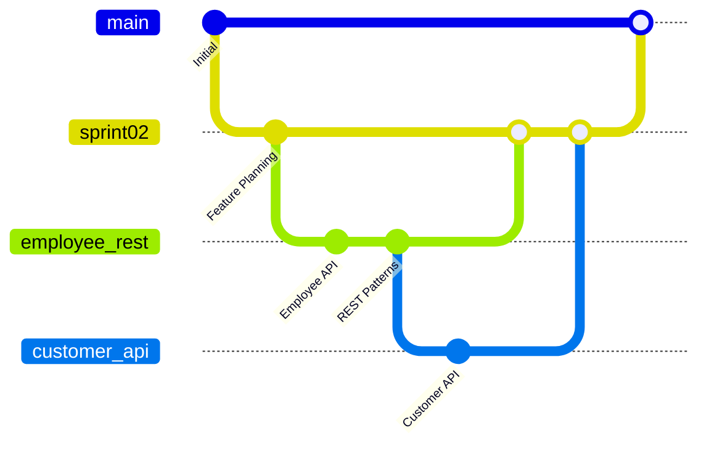

# 📚 Récapitulatif Complet - Documentation & Scripts ArchiAPI

*Document de référence centralisé - Projet ArchiAPI Template*  
*Dernière mise à jour : 31 octobre 2025*

---

## 🎯 VUE D'ENSEMBLE

Ce document centralise **TOUTES** les documentations, scripts et ressources du projet ArchiAPI. Il sert de guide de navigation pour les développeurs et de référence pour GitHub Copilot.

### **🏆 Objectif Stratégique Actuel**
- **Phase 1** : Créer des APIs REST manuelles standard IBM i
- **Phase 2** : Développer un générateur DSL automatisé
- **Cible** : Compatible React-Admin, Appsmith, Retool

---

## 📋 DOCUMENTATIONS STRATÉGIQUES

### **🎯 Documents Maîtres (PRIORITÉ ABSOLUE)**

#### 1. **API REST Standard** 🥇
**📄 `copilotInstructions/ibmi_rest_api_instructions.md`**
- **DOCUMENT CENTRAL** pour toute création d'API
- Patterns CMAGIC obligatoires
- Format JSON standard (collections `[]`, items `{}`)
- Headers X-Total-Count, pagination, filtres
- Structure RPG : .main → .route → .rest → .sqlrpgle
- **Référence** : Pattern Employee validé

#### 2. **Instructions GitHub Copilot** 🤖
**📄 `.github/copilot-instructions.md`**
- Configuration IA pour le projet
- Références docs obligatoires
- Commandes rapides type
- Règles architecture stricte

#### 3. **DSL & Architecture Future** 🚀
**📄 `dsl/docs/dsl_langium/prd_projet.md`**
- Product Requirements Document CMagic DSL v1.0
- Patterns architecturaux IBM i
- Entity as Object, CUA Commands
- State-Driven Workflow

### **📊 Planning & Stratégie**

| Document | Description | Usage |
|----------|-------------|-------|
| `EXECUTIVE_SUMMARY.md` | Vision stratégique, métriques succès | Décisions business |
| `PLAN_MISE_EN_OEUVRE.md` | Roadmap phases, livrables | Planning projet |
| `strategique/analyse_repositionnement_sept2024.md` | Stratégie "API first" | Contexte décisions |

### **📖 Guides Techniques Détaillés**

#### **Formation & Apprentissage**
```
formations/
├── formation_rpg_ile_moderne.md        # RPG ILE moderne
├── formation_api_rest_ibmi.md          # API REST IBM i spécifique
└── formation_concepts_avances.md       # IFS, SQL, JSON avancés
```

#### **Guides Techniques Détaillés**
```
guides/
├── guide_nouvelle_api_rest.md           # Guide création nouvelle API REST
├── guide_rpg_bonnes_pratiques.md       # Bonnes pratiques RPG ILE
├── guide_bob_build.md                   # Compilation avec BOB
├── GUIDE_FRAMEWORK_CREST.md             # Framework CREST détaillé
├── GUIDE_MAPPING_API_SQL.md             # Mapping API vers SQL
├── GUIDE_LISTE_CHAINEE_LLIST.md         # Gestion listes chaînées
├── GUIDE_VERSIONING_SERVICE_PROGRAMS.md # Versioning service programs
├── CMAGIC_REST_INIT_PROCEDURES.md       # Procédures d'initialisation CMAGIC
└── CONVENTIONS_REELLES_EXTRAITES.md     # Conventions extraites du code
```

#### **Architecture & Conception**
```
├── ARCHITECTURE_CMAGIC_EMPLOYEE_REST.md # Architecture Employee détaillée
├── cadrage.md                           # Cadrage projet global
└── api/
    └── KO_react_admin_api_spec_FakeRest_ra-data-simple-rest.md # Spec React-Admin
```

#### **Analyses & Benchmarks**
```
analyses/
├── benchmark_solutions_concurrentes.md  # Analyse concurrence
├── etude_faisabilite_technique.md      # Faisabilité technique
└── analyse_besoins_utilisateurs.md     # Besoins utilisateurs
```

---

## 🔧 SCRIPTS POWERSHELL - AIDE AU DÉVELOPPEMENT

### **🚀 Scripts de Génération Principale**

#### **1. Génération Ressource Complète** ⭐
```powershell
# Script principal de génération
.\scripts\Generate-ApiResource.ps1 -ResourceName "departments" -TableName "DEPARTMENTS"
```
**Fonctionnalités :**
- Structure complète selon pattern Employee
- Fichiers : .main.rpgle, .route.sqlrpgle, .rest.sqlrpgle, .sqlrpgle, .bnd
- Prototypes et includes automatiques
- Prêt pour compilation BOB

#### **2. Génération Endpoint Spécifique**
```powershell
.\scripts\Generate-ApiEndpoint.ps1 -ResourceName "employee" -Method "GET" -Path "/employees/{id}"
```
**Fonctionnalités :**
- Endpoint isolé
- Méthodes HTTP spécifiques
- Intégration routes existantes

### **⚙️ Scripts Utilitaires**

#### **Build & Compilation**
```powershell
# Build automatisé avec BOB
.\scripts\Build-Project.ps1 -Resource "employee" -Environment "dev"

# Compilation sélective
.\scripts\Compile-Resource.ps1 -Resource "customer"
```

#### **Tests & Validation**
```powershell
# Tests automatisés des APIs
.\scripts\Test-ApiEndpoints.ps1 -BaseUrl "http://server:44000" -Resource "employee"

# Validation conformité REST
.\scripts\Validate-RestApi.ps1 -Resource "employee"
```

#### **Déploiement**
```powershell
# Déploiement vers IBM i
.\scripts\Deploy-ToIBMi.ps1 -Source "src/employee" -Target "/QSYS.LIB/MYLIB.LIB"

# Synchronisation environnements
.\scripts\Sync-Environment.ps1 -From "dev" -To "test"
```

### **📚 Scripts Documentation**

```powershell
# Génération automatique documentation API
.\scripts\Generate-Documentation.ps1 -ResourcePath "src/employee"

# Mise à jour instructions Copilot
.\scripts\Update-CopilotInstructions.ps1 -NewResource "departments"

# Export OpenAPI/Swagger
.\scripts\Export-OpenApiSpec.ps1 -Resource "employee"
```

---

## 🏗️ ARCHITECTURE & PATTERNS

### **📁 Structure Projet Standard**
```
src/[resource]/
├── [resource].main.rpgle        # Point d'entrée ILEastic
├── [resource].route.sqlrpgle    # Configuration routes REST
├── [resource].rest.sqlrpgle     # Handlers HTTP + JSON
├── [resource].sqlrpgle          # Logique métier + SQL
└── [resource].bnd               # Binding source

includes/
└── [resource].rpgleinc          # Prototypes et structures
```

### **🎯 Séparation Responsabilités STRICTE**
| Fichier | Responsabilité | Contenu |
|---------|----------------|---------|
| `.main.rpgle` | Serveur/Routes | Configuration ILEastic, enregistrement routes |
| `.route.sqlrpgle` | Mapping URL | `il_addRoute()` URL → Handler |
| `.rest.sqlrpgle` | HTTP/JSON | Parse HTTP, appel métier, génération JSON |
| `.sqlrpgle` | Business Logic | SQL pur, validation, logique métier |
| `.rpgleinc` | Définitions | Types, prototypes, structures |

### **🚨 Points Critiques INCONTOURNABLES**

#### **Format JSON Obligatoire**
```rpg
// GET collection → TOUJOURS tableau []
il_addHttpHeader(response : 'Content-Type' : 'application/json');
il_addHttpHeader(response : 'X-Total-Count' : %char(lTotalCount));
il_addHttpHeader(response : 'Access-Control-Expose-Headers' : 'X-Total-Count');

// GET item → TOUJOURS objet {}
// POST → 201 Created + objet créé
// PUT/DELETE → 200 OK + objet modifié/supprimé
```

#### **Structure CMAGIC Standard**
```rpg
dcl-ds CMAGIC_context template qualified;
  dcl-ds pagination likeDS(CMAGIC_pagination);
  dcl-ds sort likeDS(CMAGIC_sort) dim(CMAGIC_MAX_SORTS);
  dcl-ds filter likeDS(CMAGIC_filter) dim(CMAGIC_MAX_FILTERS);
end-ds;

dcl-ds CMAGIC_filter template qualified;
   field varchar(32);
   operator varchar(10);  // =, LIKE, >=, <=, <>, >, <
   value varchar(100);
end-ds;
```

---

## 🌿 GESTION GIT & GITHUB - WORKFLOWS

### **📋 Structure des Branches**

#### **Branches Actuelles du Projet**
```
main                    # Branche principale - code stable
├── Sprint02           # Sprint de développement
├── ajoutBOB          # Intégration système de build BOB
├── employee_rest     # API Employee REST (branche actuelle) ⭐
├── employee_CRUD     # CRUD Employee
├── sprint1           # Premier sprint
└── employeeEntite_to_deleted # Archive - entité Employee
```

#### **🎯 Stratégie de Branches Recommandée**



### **🔄 Workflows Git Standard**

#### **1. Workflow Nouvelle Ressource API**
```bash
# 1. Créer branche feature depuis employee_rest
git checkout employee_rest
git pull origin employee_rest
git checkout -b feature/api-departments

# 2. Générer ressource avec script
.\scripts\Generate-ApiResource.ps1 -ResourceName "departments"

# 3. Développement & tests
# ... modifications code ...

# 4. Tests locaux
.\scripts\Test-ApiEndpoints.ps1 -Resource "departments"
bob --build src/departments

# 5. Commit & push
git add src/departments/ includes/department.rpgleinc
git commit -m "feat(api): add departments REST API

- Generate complete departments resource
- Follow employee pattern standards
- Include CMAGIC filters and pagination
- Add BOB build configuration

Refs: #123"

git push origin feature/api-departments

# 6. Pull Request vers employee_rest
# Via interface GitHub
```

#### **2. Workflow Hotfix Critical**
```bash
# 1. Branche hotfix depuis main
git checkout main
git pull origin main
git checkout -b hotfix/fix-employee-pagination

# 2. Fix rapide
# ... corrections ...

# 3. Test & commit
git commit -m "fix(employee): correct pagination X-Total-Count header

- Fix missing X-Total-Count in collection response
- Add CORS exposure header
- Validate with React-Admin

Fixes: #456"

# 4. Merge vers main ET employee_rest
git checkout main
git merge hotfix/fix-employee-pagination
git push origin main

git checkout employee_rest
git merge hotfix/fix-employee-pagination
git push origin employee_rest

# 5. Tag version si nécessaire
git tag -a v1.0.1 -m "Hotfix pagination Employee API"
git push origin v1.0.1
```

### **📝 Conventions Git Standards**

#### **🏷️ Nommage des Branches**
```
feature/api-[resource]        # Nouvelle API ressource
feature/[component]           # Nouvelle fonctionnalité
bugfix/[issue-description]    # Correction bug
hotfix/[critical-fix]         # Correction critique
release/v[version]            # Préparation release
docs/[documentation-type]     # Documentation
refactor/[component]          # Refactoring code
```

#### **💬 Format des Messages de Commit**
```
<type>(<scope>): <description>

[optional body]

[optional footer]
```

**Types Standards :**
- `feat` : Nouvelle fonctionnalité
- `fix` : Correction bug
- `docs` : Documentation
- `style` : Formatting, pas de changement code
- `refactor` : Refactoring sans nouvelle feature
- `test` : Ajout/modification tests
- `chore` : Maintenance, build, etc.

**Scopes Projet :**
- `api` : APIs REST
- `employee` : Ressource Employee
- `customer` : Ressource Customer
- `cmagic` : Framework CMAGIC
- `build` : Système de build BOB
- `docs` : Documentation

**Exemples :**
```bash
feat(api): add customer REST endpoints with CMAGIC filters
fix(employee): resolve X-Total-Count header missing in collection
docs(guide): update API creation workflow with Git branches
refactor(cmagic): extract common pagination logic
test(employee): add comprehensive API conformity tests
```

### **🚀 Scripts Git Intégrés**

#### **Script de Création Feature Branch**
```powershell
# .\scripts\Create-FeatureBranch.ps1
param(
    [Parameter(Mandatory=$true)]
    [string]$ResourceName,
    
    [Parameter(Mandatory=$false)]
    [string]$IssueNumber
)

# Créer branche feature
git checkout employee_rest
git pull origin employee_rest
git checkout -b "feature/api-$ResourceName"

# Générer ressource
.\scripts\Generate-ApiResource.ps1 -ResourceName $ResourceName

# Commit initial
git add -A
git commit -m "feat(api): initialize $ResourceName resource structure

- Generate base files from employee pattern
- Configure routing and REST handlers
- Add CMAGIC integration
- Prepare for API implementation

$(if ($IssueNumber) { "Refs: #$IssueNumber" })"

Write-Host "✅ Feature branch created: feature/api-$ResourceName"
Write-Host "🎯 Next steps:"
Write-Host "   1. Implement business logic in $ResourceName.sqlrpgle"
Write-Host "   2. Test with: .\scripts\Test-ApiEndpoints.ps1 -Resource $ResourceName"
Write-Host "   3. Build with: bob --build src/$ResourceName"
```

#### **Script de Release Preparation**
```powershell
# .\scripts\Prepare-Release.ps1
param(
    [Parameter(Mandatory=$true)]
    [string]$Version
)

# Créer branche release
git checkout employee_rest
git pull origin employee_rest
git checkout -b "release/v$Version"

# Tests complets
Write-Host "🧪 Running comprehensive tests..."
.\scripts\Test-All-Resources.ps1
.\scripts\Validate-All-APIs.ps1

# Mise à jour documentation
Write-Host "📚 Updating documentation..."
.\scripts\Generate-Documentation.ps1

# Commit preparation
git add -A
git commit -m "chore(release): prepare version $Version

- Update documentation
- Validate all API endpoints
- Run comprehensive test suite
- Ready for production deployment"

Write-Host "✅ Release branch created: release/v$Version"
Write-Host "🎯 Next steps:"
Write-Host "   1. Final review and testing"
Write-Host "   2. Merge to main"
Write-Host "   3. Tag version: git tag -a v$Version"
```

### **🔍 Monitoring & Intégration Continue**

#### **GitHub Actions Recommandées**
```yaml
# .github/workflows/api-validation.yml
name: API Validation
on:
  pull_request:
    branches: [ employee_rest, main ]
    paths: [ 'src/**', 'includes/**' ]

jobs:
  validate-api:
    runs-on: ubuntu-latest
    steps:
      - uses: actions/checkout@v3
      
      - name: Setup IBM i Environment
        # ... configuration environnement ...
        
      - name: Build with BOB
        run: bob --build src/
        
      - name: Test API Endpoints
        run: |
          ./scripts/Test-All-Resources.ps1
          ./scripts/Validate-REST-Conformity.ps1
          
      - name: Generate API Documentation
        run: ./scripts/Generate-OpenAPI-Spec.ps1
```

#### **Hooks Git Locaux**
```bash
# .git/hooks/pre-commit
#!/bin/sh
# Validation avant commit

echo "🔍 Running pre-commit validations..."

# Test syntaxe RPG
bob --syntax-check src/

# Validation format code
./scripts/Validate-Code-Style.ps1

# Tests rapides
./scripts/Quick-API-Tests.ps1

echo "✅ Pre-commit validations passed"
```

---

## 🧪 TESTS & VALIDATION

### **📋 Checklists de Conformité**

#### **Tests Obligatoires par Ressource**
```bash
# 1. Collection accessible
curl "http://server:44000/api/[resource]"

# 2. Header X-Total-Count présent  
curl -I "http://server:44000/api/[resource]"

# 3. Pagination fonctionnelle
curl "http://server:44000/api/[resource]?_page=1&_limit=5"

# 4. Filtres avancés
curl "http://server:44000/api/[resource]?[field]_like=pattern"
curl "http://server:44000/api/[resource]?[field]_gte=value"
```

#### **Scripts de Test Automatisés**
```
test_employee_api_conformity.ps1      # Test conformité Employee
test_phase2_filtres_avances.ps1       # Test filtres avancés
test_modular_architecture.ps1         # Test architecture modulaire
validate_modular_architecture.ps1     # Validation structure
```

---

## 🎯 WORKFLOWS & COMMANDES RAPIDES

### **🔄 Workflow Standard Nouvelle Ressource**

#### **1. Génération avec Git**
```powershell
# Script intégré Git + Génération
.\scripts\Create-FeatureBranch.ps1 -ResourceName "departments" -IssueNumber "123"
```

#### **2. Développement**
```powershell
# Implémenter logique métier
# Modifier src/departments/departments.sqlrpgle

# Tests continus
.\scripts\Test-ApiEndpoints.ps1 -Resource "departments"
```

#### **3. Validation & Commit**
```powershell
# Build final
bob --build src/departments

# Validation conformité
.\scripts\Validate-RestApi.ps1 -Resource "departments"

# Commit avec convention
git add -A
git commit -m "feat(api): implement departments business logic

- Add CRUD operations for departments
- Implement CMAGIC filters (name_like, active_eq)
- Add proper pagination with X-Total-Count
- Validate REST conformity

Closes: #123"
```

#### **4. Pull Request**
```bash
# Push vers GitHub
git push origin feature/api-departments

# Créer PR via GitHub CLI (optionnel)
gh pr create --title "feat(api): Add Departments REST API" \
  --body "Implements departments resource following employee pattern" \
  --base employee_rest \
  --head feature/api-departments
```

### **🤖 Commandes GitHub Copilot Type**

#### **Nouvelle Ressource avec Git**
```
@workspace Consulte ibmi_rest_api_instructions.md et crée une feature branch pour la ressource "departments" puis génère l'API complète selon le pattern Employee.
```

#### **Debugging avec Historique Git**
```
@workspace Selon ibmi_rest_api_instructions.md et l'historique Git, pourquoi ma collection retourne un objet au lieu d'un tableau ? Compare avec les commits récents d'Employee.
```

#### **Merge de Fonctionnalités**
```
@workspace Consulte prd_projet.md et prépare une release v1.1.0 incluant les APIs Employee et Customer. Génère les notes de version selon l'historique Git.
```

---

## 📊 MÉTRIQUES & INDICATEURS

### **🎯 Critères de Succès Phase 1**
- [ ] **Employee API** : 100% conforme REST standard
- [ ] **Customer API** : Générée et validée
- [ ] **Department API** : Exemple supplémentaire
- [ ] **Build BOB** : Succès sur IBM i
- [ ] **Tests Bruno** : Collection complète

### **🚀 Critères de Succès Phase 2**
- [ ] **Générateur DSL** : Prototype fonctionnel
- [ ] **Patterns CUA** : Implémentés (CREATE, CHANGE, DELETE, etc.)
- [ ] **Workflow États** : State Machine opérationnelle
- [ ] **Performance** : < 100ms réponse API

---

## 🔗 RÉFÉRENCES EXTERNES

### **📚 Documentation IBM i**
- [ILEastic Documentation](https://github.com/sitemule/ILEastic)
- [RPG ILE Reference](https://www.ibm.com/docs/en/i/7.5?topic=languages-ile-rpg)
- [SQL Reference IBM i](https://www.ibm.com/docs/en/i/7.5?topic=reference-sql)

### **🌐 Standards REST**
- [REST API Design Best Practices](https://restfulapi.net/)
- [HTTP Status Codes](https://httpstatuses.com/)
- [JSON API Specification](https://jsonapi.org/)

### **🔧 Outils & Frameworks**
- [React-Admin](https://marmelab.com/react-admin/)
- [Appsmith](https://www.appsmith.com/)
- [Retool](https://retool.com/)

---

## 🎓 APPRENTISSAGE & FORMATION

### **📝 Parcours Recommandé**

#### **Niveau Débutant**
1. `formations/formation_rpg_ile_moderne.md`
2. `techniques/IBM_i_DEVELOPMENT_GUIDE.md`
3. Pattern Employee (src/employee/*)

#### **Niveau Intermédiaire**
1. `copilotInstructions/ibmi_rest_api_instructions.md`
2. Scripts génération PowerShell
3. Tests automatisés

#### **Niveau Avancé**
1. `dsl/docs/dsl_langium/prd_projet.md`
2. Architecture DSL future
3. Patterns CUA avancés

---

## 🚨 POINTS D'ATTENTION & PIÈGES

### **⚠️ Erreurs Fréquentes**
1. **Oublier X-Total-Count** → React-Admin ne fonctionne pas
2. **Retourner objet au lieu de tableau** → Collection invalide
3. **Count après pagination** → Total incorrect
4. **Pas de gestion d'erreurs** → API instable

### **✅ Bonnes Pratiques**
1. **Toujours** suivre pattern Employee
2. **Tester** avec scripts PowerShell
3. **Valider** avec BOB avant commit
4. **Documenter** modifications importantes

---

## 📞 SUPPORT & AIDE

### **🆘 En cas de Problème**
1. **Consulter** `ibmi_rest_api_instructions.md`
2. **Comparer** avec pattern Employee
3. **Tester** avec scripts PowerShell
4. **Utiliser** @workspace GitHub Copilot

### **📧 Contacts Équipe**
- **Architecture** : [Architecte Lead]
- **IBM i** : [Expert IBM i]
- **API** : [Expert API REST]

---

## 🏆 CONCLUSION

Ce document centralise **TOUTE** la documentation et les scripts du projet ArchiAPI. Il doit être consulté comme **référence principale** pour :

- ✅ **Nouvelle ressource** → `ibmi_rest_api_instructions.md` + scripts génération
- ✅ **Architecture** → Patterns validés Employee
- ✅ **Tests** → Scripts PowerShell automatisés
- ✅ **Future DSL** → `prd_projet.md` et roadmap

**🎯 RÈGLE D'OR** : Toujours partir de la documentation avant d'agir, utiliser les scripts pour automatiser, valider avec les tests.

---

*Document maintenu par l'équipe ArchiAPI - Template d'application IBM i moderne*  
*Projet : applicationTemplate | Branche : employee_rest | Date : 31 octobre 2025*