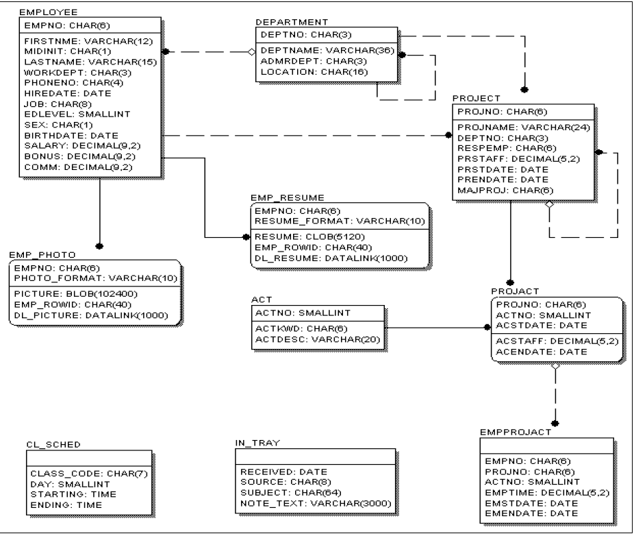

# Cadrage

## object

Developpement d'une apllication template et mvp avec une architecture moderne sur IBMI.

Ce projet utilise comme exemple la base de données fournies par IBMI DB2SAMPLE.

Ce projet utlisera essentiellement des outils open source.

- BOB pour le devops (build IBMi)
- ILEASTIC pour la publication des services REST.
- REACTADMIN pour le front oofice en React.

## ressources

## existant, état de l'art
