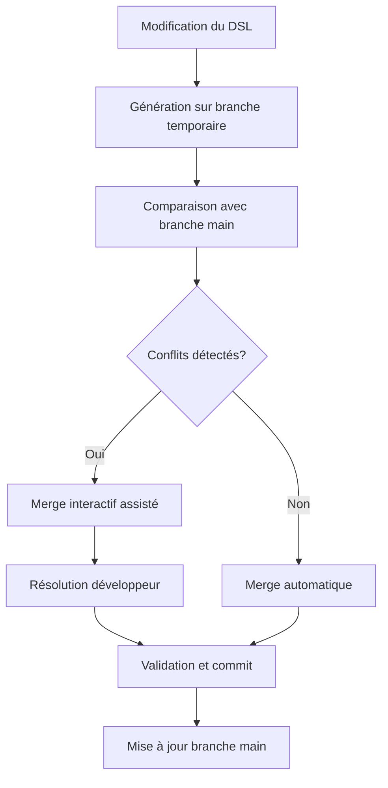

---

### **Git Workflow pour l'Extensibilité CMagic**

**Version :** 1.0  
**Date :** Décembre 2024

---

## 1. Problématique Actuelle

Le PRD initial propose un système de double couche pour gérer l'extensibilité :
- **Fichiers générés** (`_CUSTOMER_S.sqlrpgle`) : Code généré automatiquement
- **Fichiers d'extension** (`CUSTOMER_X_S.sqlrpgle`) : Code manuel du développeur

**Problèmes identifiés :**
- Complexité de maintenance (2 fichiers par entité)
- Source d'erreurs (synchronisation entre les couches)
- Courbe d'apprentissage élevée pour les développeurs
- Difficulté de debugging (logique répartie)

---

## 2. Solution Proposée : Git-Based Extensibility

### 2.1. Principe Général

Inspiration du **GitHub Copilot Agent Mode** :
- Un seul fichier par artefact généré
- Utilisation de **branches Git dédiées** pour la génération
- **Merge interactif** avec résolution de conflits assistée
- Conservation de l'historique des modifications manuelles

### 2.2. Workflow de Génération



---

## 3. Structure Git Proposée

### 3.1. Branches Spécialisées

```bash
main/                    # Code de production
├── generated/          # Branche de génération temporaire
├── feature/xxx         # Branches de développement classiques
└── backup/YYYYMMDD    # Sauvegardes automatiques
```

### 3.2. Architecture des Fichiers

**Un seul fichier par artefact :**
```
src/
├── services/
│   ├── Customer.sqlrpgle      # Code unifié (généré + manuel)
│   └── CustomerOrder.sqlrpgle # Code unifié (généré + manuel)
├── tables/
│   ├── CUSTOMERP.sql         # DDL généré
│   └── CUSTOMERORDERP.sql    # DDL généré
└── .cmagic/
    ├── annotations.json      # Métadonnées pour le merge
    └── generation.history    # Historique des générations
```

---

## 4. Processus de Génération Intelligent

### 4.1. Annotations de Code

Le générateur utilise des **annotations spéciales** pour marquer les zones :

```rpgle
// Dans Customer.sqlrpgle

// === CMAGIC_GENERATED_START:getByID ===
P Customer_getByID B EXPORT
D Customer_getByID PI LIKEDS(Customer_detail_t)
D  id             10I 0 CONST
  
  // Code généré automatiquement
  DCL-DS result LIKEDS(Customer_detail_t);
  
  // === CMAGIC_MANUAL_HOOK:data_loading ===
  // Zone réservée aux modifications manuelles
  EXEC SQL 
    SELECT * INTO :result 
    FROM CUSTOMERP 
    WHERE CUSID = :id;
  
  // Appel API personnalisé ajouté manuellement
  result.creditStatus = getCreditFromAPI(id);
  // === CMAGIC_MANUAL_HOOK_END ===
  
  RETURN result;
P Customer_getByID E
// === CMAGIC_GENERATED_END:getByID ===
```

### 4.2. Métadonnées de Merge

Le fichier `.cmagic/annotations.json` stocke les métadonnées :

```json
{
  "Customer.sqlrpgle": {
    "hooks": {
      "data_loading": {
        "lastModified": "2024-12-20T10:30:00Z",
        "author": "sophie.dev",
        "hash": "a1b2c3d4",
        "protected": true
      }
    },
    "generated_blocks": {
      "getByID": {
        "version": "1.2",
        "template": "entity_service_basic"
      }
    }
  }
}
```

---

## 5. Interface Développeur : CMagic CLI

### 5.1. Commandes Principales

```bash
# Génération avec preview
cmagic generate --preview
# Affiche les changements avant application

# Génération interactive
cmagic generate --interactive
# Mode assisté avec résolution de conflits

# Génération automatique (CI/CD)
cmagic generate --auto-merge
# Merge automatique des zones non-protégées

# Restauration d'une version
cmagic restore --backup=20241220
# Restaure depuis une sauvegarde
```

### 5.2. Interface de Résolution de Conflits

```bash
$ cmagic generate --interactive

🔄 Génération en cours...
📁 Fichier: Customer.sqlrpgle

⚠️  Conflit détecté dans la fonction 'getByID':
   • Zone générée modifiée: signature de la procédure
   • Zone manuelle préservée: logique de data_loading

Options:
[1] Accepter la nouvelle version générée (⚠️  perte des modifications manuelles)
[2] Conserver la version actuelle (❌ pas de nouvelles fonctionnalités)
[3] Merge assisté (✅ recommandé)
[4] Éditer manuellement
[q] Annuler

Choix: 3

🔧 Merge assisté...
✅ Signature mise à jour automatiquement
✅ Zone manuelle 'data_loading' préservée
✅ Merge réussi
```

---

## 6. Avantages de cette Approche

### 6.1. Pour les Développeurs

- **Simplicité** : Un seul fichier à maintenir par artefact
- **Transparence** : Historique Git complet des modifications
- **Sécurité** : Sauvegarde automatique avant chaque génération
- **Flexibilité** : Possibilité de revenir en arrière facilement

### 6.2. Pour l'Architecture

- **Cohérence** : Code unifié dans un seul fichier
- **Maintenabilité** : Pas de synchronisation entre couches
- **Évolutivité** : Templates de génération versionnés
- **Auditabilité** : Traçabilité complète des changements

### 6.3. Pour l'Équipe

- **Collaboration** : Merge conflicts classiques de Git
- **Code Review** : Revue de code unifiée sur les PR
- **CI/CD** : Intégration naturelle dans les pipelines
- **Formation** : Concepts Git familiers aux développeurs

---

## 7. Implémentation Technique

### 7.1. Moteur de Merge Intelligent

```typescript
class CMagicMerger {
  async mergeFile(
    originalFile: string,
    generatedFile: string,
    annotations: AnnotationMetadata
  ): Promise<MergeResult> {
    
    // 1. Identifier les zones protégées
    const protectedZones = this.extractProtectedZones(originalFile, annotations);
    
    // 2. Appliquer les changements générés
    const mergedContent = this.applyGeneration(originalFile, generatedFile, protectedZones);
    
    // 3. Résoudre les conflits automatiquement quand possible
    const conflicts = this.detectConflicts(mergedContent);
    
    return {
      content: mergedContent,
      conflicts: conflicts,
      needsUserInteraction: conflicts.length > 0
    };
  }
}
```

### 7.2. Templates de Génération Évolutifs

```yaml
# template-customer-service.yml
version: "1.3"
compatibility: ">=1.0"
  
blocks:
  - name: "getByID"
    type: "procedure"
    template: |
      P Customer_getByID B EXPORT
      D Customer_getByID PI LIKEDS(Customer_detail_t)
      D  id             10I 0 CONST
        
        DCL-DS result LIKEDS(Customer_detail_t);
        
        // {{ MANUAL_HOOK:data_loading }}
        
        RETURN result;
      P Customer_getByID E
```

---

## 8. Migration depuis l'Approche Double Couche

### 8.1. Script de Migration

```bash
#!/bin/bash
# migrate-to-git-workflow.sh

echo "🔄 Migration vers Git Workflow..."

# 1. Fusionner les fichiers _X dans les fichiers principaux
for entity in Customer CustomerOrder; do
  echo "📁 Migration de $entity..."
  
  # Fusionner le code manuel dans le fichier principal
  cmagic migrate-merge \
    --generated=src/${entity}_S.sqlrpgle \
    --manual=src/${entity}_X_S.sqlrpgle \
    --output=src/${entity}.sqlrpgle
    
  # Créer les annotations
  cmagic create-annotations src/${entity}.sqlrpgle
done

# 2. Créer la branche de sauvegarde
git checkout -b backup/pre-git-workflow
git add -A
git commit -m "Sauvegarde avant migration vers Git Workflow"

# 3. Nettoyer les anciens fichiers
git checkout main
rm src/*_X_S.sqlrpgle
git add -A
git commit -m "Migration vers Git Workflow terminée"

echo "✅ Migration terminée avec succès!"
```

---

## 9. Conclusion

Cette approche **Git-based** pour l'extensibilité présente plusieurs avantages majeurs :

1. **Simplicité architecturale** : Un seul fichier par artefact
2. **Robustesse** : Mécanismes Git éprouvés pour la gestion des conflits
3. **Familiarité** : Concepts connus des développeurs modernes
4. **Évolutivité** : Templates versionnés et mécanismes de migration

Le workflow proposé transforme la complexité de la double couche en un processus de génération intelligent qui respecte les modifications manuelles tout en permettant l'évolution continue du code généré.

**Recommandation** : Implémenter cette approche dans le MVP pour valider sa viabilité avant de l'étendre à l'ensemble des fonctionnalités du DSL CMagic.
