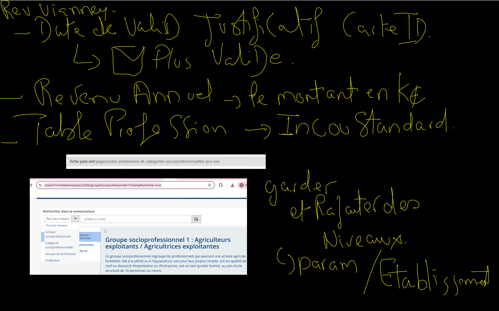
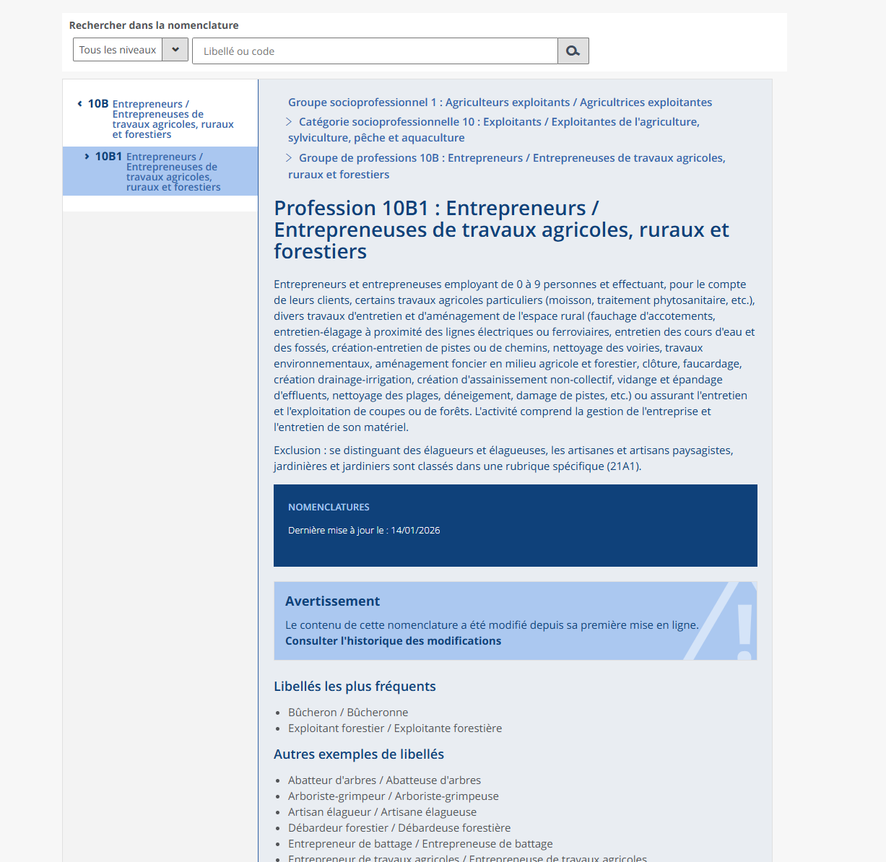

## Atelier 03/04/2024

Vianney et yvon

Vianney a echangé avec des utlisateurs (Ouissem)

### Points

1. Date de validité des pieces d'identités
2. Revenu annuel en valeur et pas de pallier
3. Table profession à revoir => rajouter des niveaux

   

   https://www.insee.fr/fr/metadonnees/pcs2020/profession/10B1

   
4.
