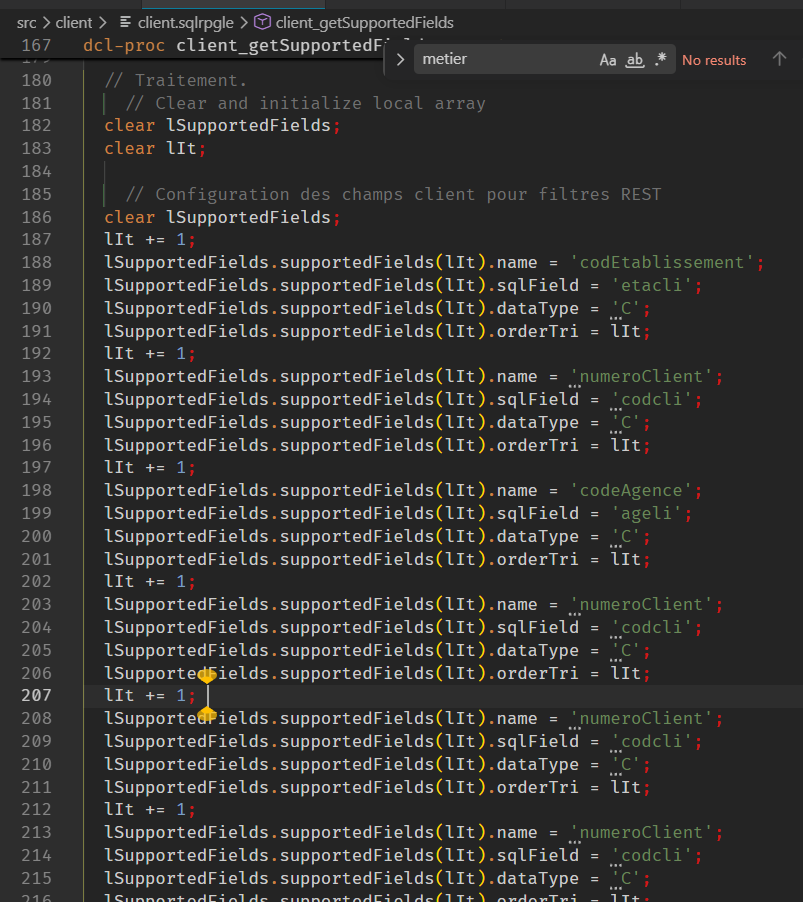

* [ ] création de la branche feat/Création del'entité CLient .
* [ ] création de lib CLIENTBIN dans C:\Users\giyvovie\Documents\mesProjets\client.0.0.1\src\main\config.inb
* [ ] modifcation de .env pour placer CLIENTBIN en curllib.
* [ ] modifcation du C:\Users\giyvovie\Documents\mesProjets\client.0.0.1\includes\client.rpgleinc

code getSupportedFields

ajouter le client.bnd
