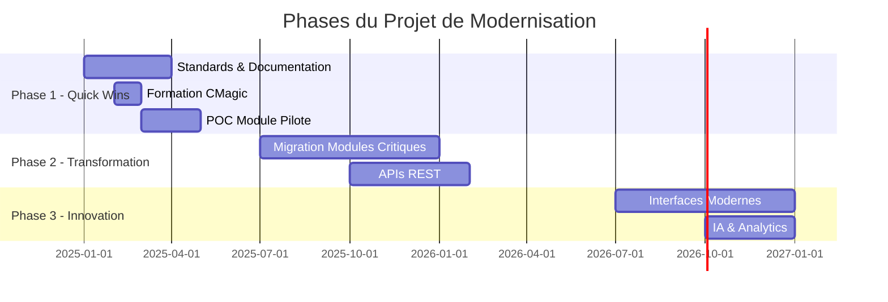

<!-- .slide: data-background="linear-gradient(135deg, #667eea 0%, #764ba2 100%)" -->

# Modernisation PROPSG

## De l'héritage Legacy à l'Innovation Digitale

---

## Contexte Critique

<div style="display: grid; grid-template-columns: 1fr 1fr; gap: 40px;">

<div>

### Notre Réalité Actuelle

- **5000** lignes de code par programme
- **101+** dépendances entremêlées
- **0** documentation technique
- **RPG3** format colonné (1980s)
- Départs progressifs des experts

</div>

<div>

### Les Enjeux

- **Risque opérationnel** critique
- **Maintenance** de plus en plus coûteuse
- **Recrutement** quasi-impossible
- **Innovation** bloquée
- **Conformité** difficile à garantir

</div>

</div>

Note: Le système actuel est une bombe à retardement. Chaque expert qui part emporte une partie critique de la connaissance.

---

## L'Architecture Actuelle

### Un Système Monolithique

```
    ┌─────────────────────┐
    │   PROPSG Monolithe  │
    └──────────┬──────────┘
               │
    ┌──────────┼──────────┐
    │          │          │
    ▼          ▼          ▼
┌─────────┐ ┌─────────┐ ┌─────────┐
│ CLIMAJ  │ │PRETGAGE │ │ VENTES  │
│5000 lignes│3000 lignes│4000 lignes│
└─────────┘ └─────────┘ └─────────┘
      \        |        /
       \       |       /
        ▼      ▼      ▼
    ┌──────────────────┐
    │ 101 Dépendances  │
    └──────────────────┘
            │
            ▼
    ┌──────────────────┐
    │   Base DB2       │
    │   Non-SQL        │
    └──────────────────┘
```

### Problématiques Identifiées

- 🔴 **Couplage fort** : Modification = risque système
- 🔴 **Pas de tests** : Chaque changement est un pari
- 🔴 **Code opaque** : Logique métier enfouie

---

## Notre Vision de Transformation

<div style="display: grid; grid-template-columns: repeat(3, 1fr); gap: 30px; margin-top: 40px;">

<div style="text-align: center;">
  <h3>🎯 Phase 1</h3>
  <h4 style="color: #3498db;">Quick Wins</h4>
  <p><small>0-6 mois</small></p>
  <ul style="text-align: left; font-size: 0.8em;">
    <li>Standards & normes</li>
    <li>Documentation</li>
    <li>RPG Free Format</li>
    <li>Nouveaux modules avec <strong>CMagic</strong></li>
  </ul>
</div>

<div style="text-align: center;">
  <h3>🚀 Phase 2</h3>
  <h4 style="color: #2ecc71;">Transformation</h4>
  <p><small>6-18 mois</small></p>
  <ul style="text-align: left; font-size: 0.8em;">
    <li>Modularisation SRVPGM</li>
    <li>Migration SQL progressive</li>
    <li>APIs REST</li>
    <li>Génération <strong>CMagic</strong> massive</li>
  </ul>
</div>

<div style="text-align: center;">
  <h3>✨ Phase 3</h3>
  <h4 style="color: #9b59b6;">Innovation</h4>
  <p><small>18+ mois</small></p>
  <ul style="text-align: left; font-size: 0.8em;">
    <li>Interfaces modernes</li>
    <li>IA & Analytics</li>
    <li>DevOps complet</li>
    <li>Architecture événementielle</li>
  </ul>
</div>

</div>

---

## Innovation : Projet CMagic

### Notre Accélérateur de Modernisation

Un **générateur de code intelligent** basé sur un DSL (Domain Specific Language) qui transforme des définitions métier simples en code RPG moderne complet.

--

### Le Concept CMagic

<div style="display: grid; grid-template-columns: 1fr 1fr; gap: 40px;">

<div>

#### Vous écrivez :

```jdl
entity Customer {
  id: Int required,
  name: String(80) required,
  status: CustomerStatus
}

operations for Customer {
  CREATE, CHANGE, DELETE, 
  DISPLAY, WORK_WITH
}
```

</div>

<div>

#### CMagic génère :

```bash
✅ Customer_H.rpgleinc    # Structures
✅ Customer_S.sqlrpgle    # Services CRUD
✅ CUSTOMERP.sql          # DDL
✅ CustomerWrk.dspf       # Écrans
✅ Customer_T.sqlrpgle    # Tests

⚡ 2,847 lignes en 3 secondes
```

</div>

</div>

--

### Bénéfices Immédiats

<div style="display: grid; grid-template-columns: repeat(4, 1fr); gap: 20px; margin-top: 40px;">

<div style="text-align: center;">
  <h3 style="color: #e74c3c;">-85%</h3>
  <p>Temps de développement</p>
</div>

<div style="text-align: center;">
  <h3 style="color: #3498db;">-90%</h3>
  <p>Bugs en production</p>
</div>

<div style="text-align: center;">
  <h3 style="color: #2ecc71;">100%</h3>
  <p>Documentation auto</p>
</div>

<div style="text-align: center;">
  <h3 style="color: #f39c12;">100%</h3>
  <p>Respect standards</p>
</div>

</div>

---

## Comparaison : Avant vs Après

<div style="display: grid; grid-template-columns: 1fr 1fr; gap: 40px;">

<div>

### Sans CMagic 😰

```rpg
     C     KCUST     KLIST
     C                   KFLD                    CUSTID
     C     KCUST     CHAIN     CUSTMAST
     C                   IF        %FOUND()
     C                   EVAL      NAME = CUSNAM
     C                   EVAL      ADDR = CUSADR
     C                   UPDATE    CUSTREC
     C                   ENDIF
```

- 3 semaines de développement
- Documentation manuelle
- Tests manuels
- Maintenance complexe

</div>

<div>

### Avec CMagic 🚀

```typescript
entity Customer {
  id: Int required,
  name: String(80),
  address: Address
}
```

- 2 jours (définition + customisation)
- Documentation générée
- Tests automatiques
- Maintenance simplifiée

</div>

</div>

---

<!-- .slide: data-background="#2ecc71" -->

## ROI Démontré

<div style="text-align: center;">
  <h1 style="font-size: 4em; color: white;">18 mois</h1>
  <h3 style="color: white;">Retour sur investissement</h3>
</div>

<div style="display: grid; grid-template-columns: repeat(3, 1fr); gap: 40px; margin-top: 60px;">

<div style="text-align: center;">
  <h2 style="color: white;">-60%</h2>
  <p style="color: white;">Coûts maintenance</p>
</div>

<div style="text-align: center;">
  <h2 style="color: white;">+200%</h2>
  <p style="color: white;">Productivité</p>
</div>

<div style="text-align: center;">
  <h2 style="color: white;">×5</h2>
  <p style="color: white;">Vitesse livraison</p>
</div>

</div>

---

## Roadmap de Transformation



---

## Équipe et Organisation

<div style="display: grid; grid-template-columns: 1fr 1fr; gap: 40px;">

<div>

### Core Team (4 personnes)

- **1 Architecte Lead** CMagic/IBMi
- **2 Développeurs** RPG/CMagic
- **1 Expert Métier** PROPSG

#### Rôles Clés

- 🎯 Définition architecture cible
- 🔧 Développement générateurs CMagic
- 📚 Formation des équipes
- ✅ Validation qualité

</div>

<div>

### Support Étendu

- **Experts métier** par domaine
- **Testeurs** automatisation
- **Formateurs** internes
- **Support IBM** ponctuel

#### Montée en Charge

- Q1: 4 personnes
- Q2: 8 personnes
- Q3: 12 personnes
- Q4: Équipe complète

</div>

</div>

---

## Budget et Investissement

<div style="display: grid; grid-template-columns: 1fr 1fr; gap: 60px;">

<div>

### Investissement

| Poste | Année 1 | Année 2 |
|-------|---------|---------|
| Équipe dédiée | 400k€ | 300k€ |
| Formation | 50k€ | 20k€ |
| Tooling CMagic | 30k€ | 10k€ |
| Support externe | 100k€ | 50k€ |
| **Total** | **580k€** | **380k€** |

</div>

<div>

### Retour sur Investissement

#### Économies Directes
- **-300k€/an** maintenance
- **-200k€/an** incidents
- **-100k€/an** développements

<div style="margin-top: 40px; padding: 20px; background: rgba(46, 204, 113, 0.2); border-radius: 10px;">
  <h3 style="text-align: center; color: #27ae60;">ROI: 420% sur 3 ans</h3>
</div>

</div>

</div>

---

## Gestion des Risques

<div style="margin-top: 40px;">

<div style="padding: 20px; margin: 10px; background: rgba(241, 196, 15, 0.1); border-left: 4px solid #f1c40f;">
  <h4>⚠️ Résistance au changement</h4>
  <p><small><strong>Mitigation:</strong> Formation continue + Quick wins visibles + Implication équipes</small></p>
</div>

<div style="padding: 20px; margin: 10px; background: rgba(230, 126, 34, 0.1); border-left: 4px solid #e67e22;">
  <h4>🔧 Complexité technique</h4>
  <p><small><strong>Mitigation:</strong> CMagic + Approche progressive + Zones protégées</small></p>
</div>

<div style="padding: 20px; margin: 10px; background: rgba(52, 152, 219, 0.1); border-left: 4px solid #3498db;">
  <h4>👥 Compétences DSL</h4>
  <p><small><strong>Mitigation:</strong> Syntaxe simple + Formation 2 jours + Documentation</small></p>
</div>

<div style="padding: 20px; margin: 10px; background: rgba(46, 204, 113, 0.1); border-left: 4px solid #2ecc71;">
  <h4>✅ Continuité de service</h4>
  <p><small><strong>Mitigation:</strong> Migration progressive + Tests automatisés + Rollback possible</small></p>
</div>

</div>

---

<!-- .slide: data-background="linear-gradient(135deg, #667eea 0%, #764ba2 100%)" -->

## Décisions Attendues

<div style="margin-top: 60px;">

<h3 style="color: white;">1. ✅ Validation de la stratégie de modernisation</h3>

<h3 style="color: white;">2. ✅ Lancement du projet CMagic</h3>

<h3 style="color: white;">3. ✅ Allocation de l'équipe dédiée (4 personnes)</h3>

<h3 style="color: white;">4. ✅ Budget Phase 1 (580k€)</h3>

<h3 style="color: white;">5. ✅ Sponsor exécutif désigné</h3>

</div>

---

<!-- .slide: data-background="linear-gradient(135deg, #667eea 0%, #764ba2 100%)" -->

# Questions & Discussion

<div style="margin-top: 60px;">
  <h3 style="color: white;">La modernisation n'est plus une option,<br/>
  c'est une nécessité stratégique.</h3>
  
  <h3 style="color: white; margin-top: 40px;">Avec CMagic, nous transformons<br/>
  cette nécessité en opportunité.</h3>
</div>

<div style="margin-top: 80px; color: white; font-size: 0.8em;">
  Contact: equipe-modernisation@cm-services.fr<br/>
  Documentation: https://cmagic.cm-services.fr
</div>