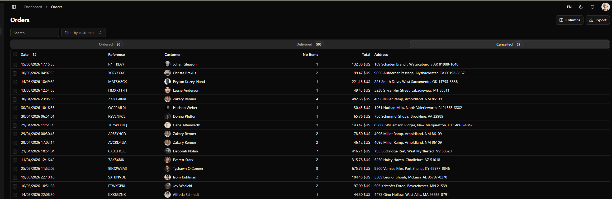
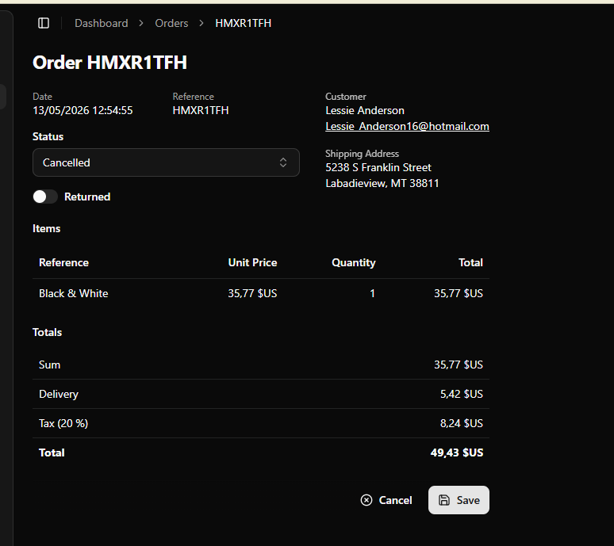

# Commandes et statuts

_Statut : état du prototype et questions métier ouvertes._

## Modèle actuel

La ressource `orders` contient :

| Champ | Type | Rôle |
| --- | --- | --- |
| `id` | identifiant React Admin | clé technique |
| `reference` | chaîne | référence visible |
| `date` | date ISO | date de commande |
| `customer_id` | identifiant | relation vers `customers` |
| `basket` | tableau | lignes réduites à `product_id` et `quantity` |
| `total_ex_taxes` | nombre | total hors taxes |
| `delivery_fees` | nombre | frais de livraison |
| `tax_rate` | nombre | taux de taxe décimal |
| `taxes` | nombre | montant des taxes |
| `total` | nombre | total toutes taxes comprises |
| `status` | énumération | `ordered`, `delivered` ou `canceled` |
| `returned` | booléen | présence d'un retour |

## Interface implémentée

- liste séparée par onglets de statut ;
- compteur par statut ;
- recherche et filtre par client ;
- choix des colonnes et export ;
- ouverture de la commande en édition ;
- modification du client, de la date, du statut et de `returned` ;
- affichage du panier et des totaux.

Les captures proviennent du kit de référence et peuvent différer du prototype local.

## Nature du modèle

L'implémentation actuelle est un prototype CRUD avec statut éditable. Elle ne constitue
pas encore un processus métier CMagic : aucune transition n'est contrôlée et aucune action
`livrer`, `annuler` ou `retourner` n'est définie côté backend.

## Règles à décider avant implémentation métier

1. Une commande livrée peut-elle être annulée ?
2. Un retour est-il un booléen ou une ressource avec lignes, quantités et motif ?
3. Les montants sont-ils saisis, calculés ou figés lors de la commande ?
4. Quel arrondi monétaire s'applique à la taxe et au total ?
5. Le panier peut-il changer après le passage au statut `ordered` ?
6. Faut-il conserver un historique des transitions et leur auteur ?
7. Quelles actions sont idempotentes ?

## Références d'origine

- [Exemple orders de shadcn-admin-kit](https://github.com/marmelab/shadcn-admin-kit/tree/main/src/demo/orders)
- [OrderList de référence](https://github.com/marmelab/shadcn-admin-kit/blob/main/src/demo/orders/OrderList.tsx)
- [OrderEdit de référence](https://github.com/marmelab/shadcn-admin-kit/blob/main/src/demo/orders/OrderEdit.tsx)
