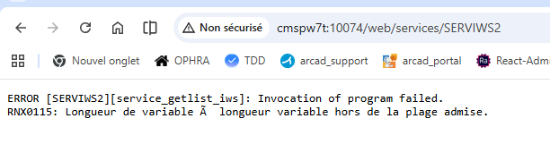
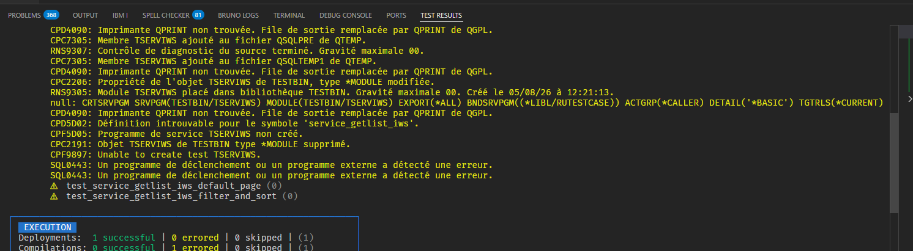
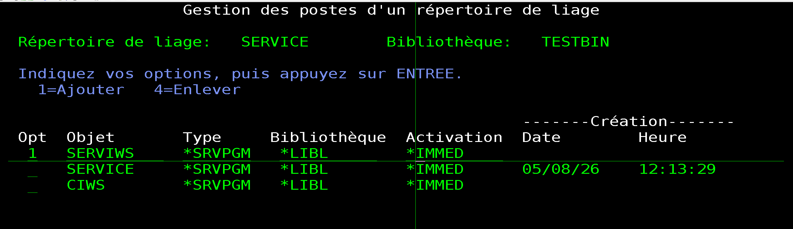
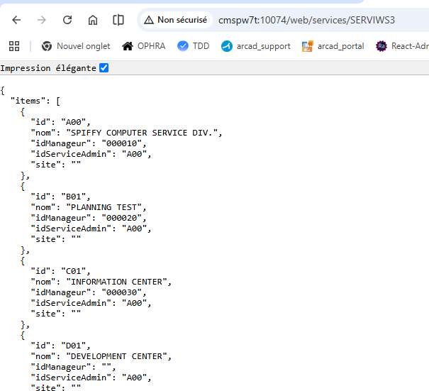
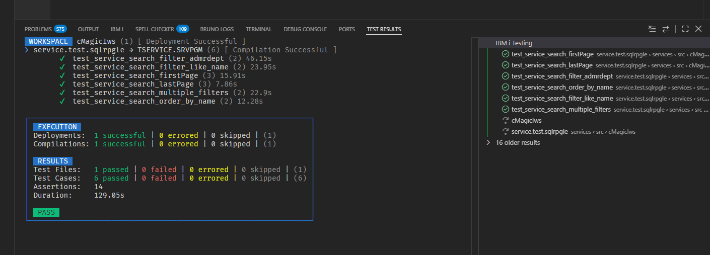
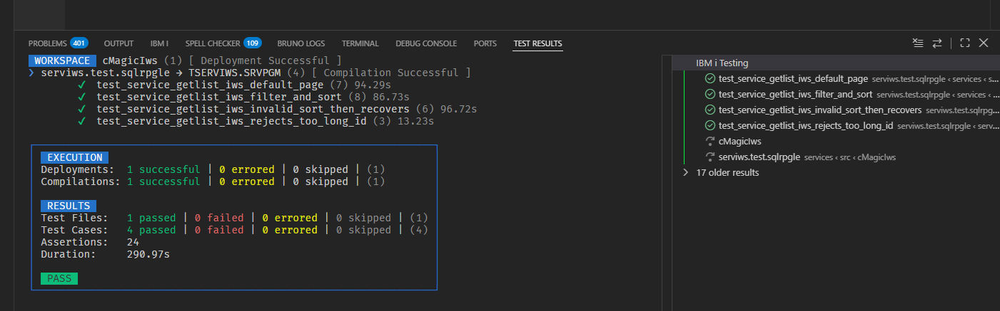
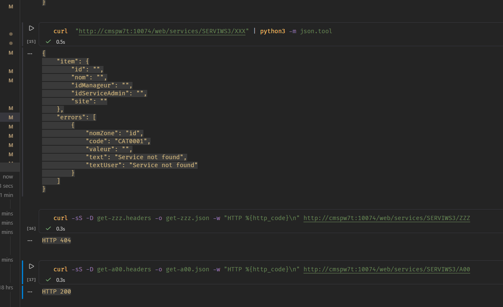
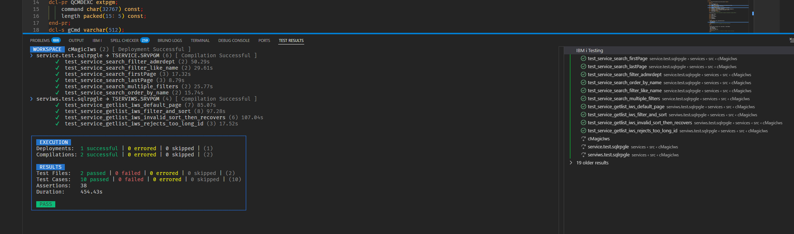

# Recette IBM i du catalogue CMagic avec IWS

Cette procédure permet de compiler, déployer et tester sur IBM i le catalogue
`Service` généré par CMagic pour **IBM Integrated Web Services (IWS)**.

Elle a été préparée pour la séance du **30 juillet 2026**, mise à jour le
**5 août 2026** après la validation fonctionnelle du service IWS, puis étendue le
**6 août 2026** avec le `GET` par identifiant et le retour d'expérience sur les binding
directories. La correction du wrapper `LIST` validée sur IBM i est incluse dans
`6d7a41e`. Le contrat `GET` est déployé et sa validation IBM i est acceptée avec la
limite de preuve explicitée dans le compte rendu. La tranche `CREATE` est désormais
implémentée et validée localement ; les étapes ci-dessous préparent sa première
validation IBM i.

La recette doit être exécutée dans une bibliothèque et sur un serveur IWS de test.
Elle ne remplace pas la
[recette ILEastic](./recette-ibmi-catalogue.md) : les deux transports doivent être
évalués séparément avant de décider des suites.

## 1. Objectif et limites de cette recette

La recette doit établir que :

1. les sources IWS générées se compilent sans modification manuelle ;
2. `SERVICE.SRVPGM`, `SERVICE.BNDDIR`, `SERVIWS.SRVPGM` et `SERVIWS.BNDDIR` sont
   créés ;
3. `SERVIWS` exporte `service_getlist_iws`, `service_getone_iws`, puis
   `service_create_iws` ;
4. le serveur IWS transmet `QUERY_STRING` au wrapper RPG ;
5. les recherches, filtres, tris et paginations utilisent le même
   `service_search` que le transport ILEastic ;
6. `httpStatus` pilote réellement le statut HTTP ;
7. `httpHeaders` produit notamment `X-Total-Count` ;
8. les erreurs de requête ne provoquent pas d'arrêt du service IWS ;
9. `GET /SERVIWS3/{id}` renvoie un détail en `200` ou une erreur en `404` ;
10. `POST /SERVIWS3/` crée une entité validée en `201`, rejette les données invalides
    en `400`, les doublons en `409` et les erreurs techniques en `500`.

Cette version couvre la lecture et la création :

- `LIST`/`SEARCH` a été validé sur IBM i le 5 août 2026 ;
- `GET` par identifiant est généré, déployé et accepté sur IBM i : `A00` répond `200`,
  `/ZZZ` répond `404` et `/XXX` renvoie une erreur portant sur `id` ;
- `CREATE` est généré et validé localement, mais pas encore accepté sur IBM i ;
- `UPDATE` et `DELETE` ne sont pas générés ;
- la réponse IWS nominale est `{ items, totalCount, errors }`, et non l'enveloppe
  ILEastic `{ data, total }` ;
- la réponse IWS de détail est `{ item, errors }` ;
- la réponse IWS de création est également `{ item, errors }` ;
- `Access-Control-Expose-Headers` est produit, mais cela ne configure pas à lui seul
  une politique CORS complète.

Utiliser `curl` ou Bruno pour cette recette, pas directement le navigateur de
`mySchadcn`.

## 2. Valeurs à noter avant de commencer

| Paramètre | Exemple | Valeur du test |
| --- | --- | --- |
| Hôte IBM i | `cmspw7t` | `cmspw7t` |
| Utilisateur de déploiement | `GIYVOVIE` | |
| Racine du projet BOB/TOBi | `/home/user/projects/applicationTemplate` | |
| Bibliothèque de test | `CMAGICTST` | |
| Bibliothèque contenant `CIWS` | `CKOOLBIN` ou autre | |
| Nom du serveur IWS | `CMAGICIWS` | |
| Version IWS | `2.6` ou `3.0` | `2.6` |
| Port HTTP du serveur IWS | `10074` | `10074` |
| Profil d'exécution du service | `QWSERVICE` ou profil dédié | |
| Nom public du service | `SERVICES` | `SERVIWS3` |
| Racine de contexte | `/web/services` | `/web/services` |
| Commit testé | commit de la tranche | à relever après le commit local de la tranche 8 ; base de lecture acceptée : `396d102` |
| Version IBM i | `7.4`, `7.5` ou `7.6` | |
| Version BOB/TOBi | sortie de `makei --version` | |

URL attendue si les exemples du tableau sont conservés :

```text
http://cmspw7t:10074/web/services/SERVIWS3
```

Ne pas réutiliser sans vérification un service IWS de production. Si `SERVICES`
existe déjà sur le serveur choisi, utiliser un autre nom, par exemple
`SERVTST`.

## 3. Porte 1 — Figer les artefacts locaux

Depuis PowerShell :

```powershell
cd C:\Users\giyvovie\Documents\mesProjets\mySchadcn\projets_annexes\cmagic_perso
npm.cmd test
npm.cmd run build
node bin/cli.js generate-catalog examples/service-catalogue-iws.cmagic `
  --destination examples/generated-catalog-iws
git -c safe.directory=C:/Users/giyvovie/Documents/mesProjets/mySchadcn `
  diff --exit-code -- examples/service-catalogue-iws.cmagic `
  examples/generated-catalog-iws
```

Résultat attendu :

- suite CMagic entièrement réussie (compteur exact relevé lors de la porte 1) ;
- build réussi ;
- aucune différence après régénération ;
- présence des fichiers suivants :

```text
generated-catalog-iws/
├── Rules.mk
├── includes/
│   ├── services.read.rpgleinc
│   └── services.iws.rpgleinc
└── services/
    ├── Rules.mk
    ├── service.test.sqlrpgle
    ├── services.bnd
    ├── services.iws.bnd
    ├── services.iws.bnddir
    ├── services.read.bnddir
    ├── services.read.rpgleinc
    ├── services.read.sqlrpgle
    ├── services.iws.rpgleinc
    ├── services.iws.sqlrpgle
    ├── serviws.test.sqlrpgle
    └── testing.json
```

Les fichiers `services.ileastic.*` sont encore générés pour compatibilité, mais
`Rules.mk` ne contient aucune cible `SERVREST` dans cet exemple IWS.

Les fichiers sous `services/` sont les sources de production. Les copies sous
`includes/` sont réservées aux tests : le générateur ne doit pas déplacer ni remplacer
`services/services.read.rpgleinc`. Les enveloppes `service.test.sqlrpgle` et
`serviws.test.sqlrpgle` sont volontairement minimales afin que le développeur complète
les cas propres à son catalogue. `testing.json` déclare les objets `SERVICE` et
`SERVIWS` à RPGUnit.

Arrêter la recette si la régénération produit une différence : les sources testées ne
correspondraient plus au commit annoncé.

## 4. Porte 2 — Installer les sources dans le projet BOB/TOBi

Transférer l'ensemble de :

```text
projets_annexes/cmagic_perso/examples/generated-catalog-iws/
```

vers un dossier dédié du projet IBM i, par exemple :

```text
<applicationTemplate>/src/cmagic-generated-iws/
```

Vérifier sur IBM i :

```bash
cd /home/user/projects/applicationTemplate
find src/cmagic-generated-iws -maxdepth 2 -type f | sort
```

Ajouter le dossier généré à `includePath` dans `iproj.json`, sans supprimer les
entrées existantes :

```json
{
  "includePath": [
    "includes",
    "src/cmagic-generated-iws",
    "src/cmagic-generated-iws/services",
    "/usr/local/include"
  ]
}
```

Conserver les bibliothèques runtime existantes et ajouter la bibliothèque contenant
`CIWS` si elle n'est pas déjà présente. Exemple :

```json
{
  "preUsrlibl": [
    "CKOOLBIN"
  ],
  "postUsrlibl": [
    "DB2SAMPLE",
    "ILEASTIC"
  ]
}
```

Vérifier le `.env` du projet :

```dotenv
CURLIB=CMAGICTST
```

Créer la bibliothèque uniquement si elle n'existe pas :

```cl
CRTLIB LIB(CMAGICTST) TEXT('Tests catalogue CMagic IWS')
```

## 5. Porte 3 — Vérifier les prérequis IBM i

### 5.1 Données de référence

Depuis ACS Run SQL Scripts :

```sql
SELECT COUNT(*) AS TOTAL
FROM DB2SAMPLE.DEPARTMENT;

SELECT DEPTNO, DEPTNAME, MGRNO, ADMRDEPT, LOCATION
FROM DB2SAMPLE.DEPARTMENT
ORDER BY DEPTNO
FETCH FIRST 10 ROWS ONLY;
```

Noter le nombre total et un identifiant existant, par exemple `A00`.

### 5.2 Runtime et includes

Depuis une session 5250 :

```cl
WRKOBJ OBJ(*ALL/CIWS) OBJTYPE(*SRVPGM)
WRKOBJ OBJ(*ALL/CKOOL) OBJTYPE(*BNDDIR)
WRKOBJ OBJ(*ALL/NOXDB) OBJTYPE(*BNDDIR)
WRKOBJ OBJ(DB2SAMPLE/DEPARTMENT) OBJTYPE(*FILE)
```

Le service program `CIWS` est un prérequis partagé. Le wrapper le résout indirectement
par le binding directory `CKOOL` ; les règles générées ne le référencent pas et ne le
reconstruisent pas.

La validation de longueur des filtres nécessite `CMAGIC.0.0.2`. Cette version ajoute
`maxLength` à `CMAGIC_supportedField` et concentre le contrôle dans
`cmagic_sanitizeContext`. Depuis le projet CMagic, reconstruire d'abord :

```bash
makei build -v -t CMAGIC.MODULE
makei build -v -t CMAGIC.SRVPGM
```

L'include `cmagic.rpgleinc` utilisé par le catalogue doit provenir de cette même
version. La structure partagée ayant évolué, `SERVICE.SRVPGM` doit ensuite être relié
à nouveau ; ne pas mélanger l'include `0.0.2` avec un ancien objet CMagic.

Depuis PASE :

```bash
for cmagic_iws_header in \
  includes/ciws.rpgleinc \
  includes/cmagic.rpgleinc \
  includes/global.rpgleinc \
  includes/httpRest.rpgleinc \
  /usr/local/include/sqlstates.rpginc \
  /usr/local/include/llist/llist_h.rpgle \
  /usr/local/include/ileastic/noxdb.rpgleinc
do
  test -f "$cmagic_iws_header" \
    && echo "OK      $cmagic_iws_header" \
    || echo "MISSING $cmagic_iws_header"
done
```

Adapter les chemins si le projet conserve ses includes ailleurs. Un fichier manquant
bloque la compilation.

### 5.3 Serveur IWS

Ouvrir IBM Web Administration for i :

```text
http://<hote>:2001/HTTPAdmin
```

ou, si l'administration SSL est configurée :

```text
https://<hote>:2010/HTTPAdmin
```

Dans `Manage > Application Servers`, sélectionner le serveur de test et noter :

- son état ;
- son type et sa version IWS ;
- son port HTTP ou HTTPS ;
- son profil d'exécution ;
- sa racine de contexte.

Le serveur doit être démarré avant le déploiement. Ne pas créer un nouveau serveur si
un serveur IWS de test adapté existe déjà.

## 6. Porte 4 — Compiler les six objets générés

Depuis la racine du projet BOB/TOBi :

```bash
mkdir -p validation-cmagic-iws-20260730
makei --version
makei list
makei build -v -l src/cmagic-generated-iws/services \
  > validation-cmagic-iws-20260730/build.log 2>&1
cmagic_iws_build_rc=$?
tail -n 120 validation-cmagic-iws-20260730/build.log
echo "BOB return code: $cmagic_iws_build_rc"
```

Le code retour attendu est `0`.

En cas d'échec global, construire les cibles dans cet ordre pour isoler la première
erreur :

```bash
makei build -v -t SERVICE.MODULE
makei build -v -t SERVICE.SRVPGM
makei build -v -t SERVICE.BNDDIR
makei build -v -t SERVIWS.MODULE
makei build -v -t SERVIWS.SRVPGM
makei build -v -t SERVIWS.BNDDIR
```

Ne pas ajouter `SERVICE` ou `SERVIWS` au binding directory partagé `CKOOL`. Les deux
fichiers générés matérialisent les étapes du graphe :

- `services.read.bnddir` crée `SERVICE.BNDDIR` avec `SERVICE.SRVPGM`, pour construire
  `SERVIWS.SRVPGM` ;
- `services.iws.bnddir` crée ensuite `SERVIWS.BNDDIR` avec `SERVICE.SRVPGM` et
  `SERVIWS.SRVPGM`, pour exécuter les tests RPGUnit du transport.

Le runtime `CIWS` est déjà résolu par le binding directory partagé `CKOOL` déclaré dans
le wrapper. Il ne doit pas être ajouté à ces binding directories applicatifs ni aux
dépendances BOB générées.

### Objets attendus

```cl
DSPOBJD OBJ(CMAGICTST/SERVICE) OBJTYPE(*MODULE)
DSPOBJD OBJ(CMAGICTST/SERVICE) OBJTYPE(*SRVPGM)
DSPOBJD OBJ(CMAGICTST/SERVICE) OBJTYPE(*BNDDIR)
DSPOBJD OBJ(CMAGICTST/SERVIWS) OBJTYPE(*MODULE)
DSPOBJD OBJ(CMAGICTST/SERVIWS) OBJTYPE(*SRVPGM)
DSPOBJD OBJ(CMAGICTST/SERVIWS) OBJTYPE(*BNDDIR)
```

Contrôler ensuite les entrées et exports :

```cl
DSPBNDDIRE BNDDIR(CMAGICTST/SERVICE)
DSPBNDDIRE BNDDIR(CMAGICTST/SERVIWS)
DSPSRVPGM SRVPGM(CMAGICTST/SERVICE) DETAIL(*PROCEXP)
DSPSRVPGM SRVPGM(CMAGICTST/SERVIWS) DETAIL(*PROCEXP)
```

Attendu :

- `SERVICE.BNDDIR` contient uniquement `SERVICE` ;
- `SERVIWS.BNDDIR` contient `SERVICE` et `SERVIWS` ;
- `SERVICE.SRVPGM` exporte `service_search`, `service_getSupportedFields`,
  `service_get`, `service_create` et `service_isValid` ;
- `SERVIWS.SRVPGM` exporte `service_getlist_iws` puis
  `service_getone_iws`, puis `service_create_iws`.

Si le build échoue, conserver le premier message complet et le log. Ne pas corriger
directement les sources générées : la correction devra être faite dans CMagic puis
régénérée.

## 7. Porte 5 — Déployer `SERVIWS` comme service REST

Les libellés exacts peuvent varier légèrement entre IWS 2.6 et IWS 3.0. Les valeurs
fonctionnelles à obtenir restent les mêmes.

Dans IBM Web Administration for i :

1. ouvrir `Manage > Application Servers` ;
2. sélectionner le serveur IWS de test ;
3. choisir `Install New Service` ou `Deploy New Service` ;
4. sélectionner le type **REST** ;
5. indiquer :
   - bibliothèque : `CMAGICTST` ;
   - objet : `SERVIWS` ;
   - type : `*SRVPGM` ;
6. utiliser le PCML stocké dans l'objet ; aucun fichier PCML IFS séparé ne devrait être
   demandé grâce à `pgminfo(*pcml:*module:*dclcase)` ;
7. nommer la ressource `SERVIWS3` dans l'environnement de recette ;
8. ne pas définir de chemin supplémentaire au niveau de la ressource ;
9. sélectionner les procédures `service_getlist_iws`, `service_getone_iws` et
   `service_create_iws`.

### 7.1 Usage des paramètres

Pour `service_getlist_iws`, configurer tous les paramètres comme sorties :

| Paramètre | Usage | Traitement IWS |
| --- | --- | --- |
| `items_LENGTH` | Output | longueur du tableau `items` |
| `items` | Output | corps JSON |
| `totalCount` | Output | corps JSON |
| `errors_LENGTH` | Output | longueur du tableau `errors` |
| `errors` | Output | corps JSON |
| `httpStatus` | Output | **HTTP response/status code** |
| `httpHeaders` | Output | **HTTP response headers** |

Pour `service_getone_iws`, configurer :

| Paramètre | Usage | Traitement IWS |
| --- | --- | --- |
| `id` | Input | injecté depuis la variable `{id}` du chemin |
| `item` | Output | corps JSON de détail |
| `errors_LENGTH` | Output | longueur du tableau `errors` |
| `errors` | Output | corps JSON |
| `httpStatus` | Output | **HTTP response/status code** |
| `httpHeaders` | Output | **HTTP response headers** |

Pour `service_create_iws`, configurer :

| Paramètre | Usage | Traitement IWS |
| --- | --- | --- |
| `input` | Input | corps JSON de l'entité à créer |
| `item` | Output | corps JSON de l'entité persistée puis relue |
| `errors_LENGTH` | Output | longueur du tableau `errors` |
| `errors` | Output | corps JSON |
| `httpStatus` | Output | **HTTP response/status code** |
| `httpHeaders` | Output | **HTTP response headers** |

Activer **Detect length fields** ou l'option équivalente. Le but est que
`items_LENGTH` et `errors_LENGTH` pilotent la taille des tableaux sans apparaître dans
le JSON public.

### 7.2 Propriétés REST de la méthode

Pour `service_getlist_iws`, choisir :

| Propriété | Valeur |
| --- | --- |
| Méthode HTTP | `GET` |
| URI path template de la méthode | `*NONE` ou vide |
| Type de contenu entrant | `*ALL` |
| Type de contenu produit | `JSON` |
| Paramètre du statut HTTP | `httpStatus` |
| Paramètre des en-têtes HTTP | `httpHeaders` |
| Paramètres de sortie | enveloppés |

Il n'y a aucun paramètre d'entrée HTTP direct : les critères sont lus dans
`QUERY_STRING` par `CIWS_initRestRequest`.

Pour `service_getone_iws`, choisir :

| Propriété | Valeur |
| --- | --- |
| Méthode HTTP | `GET` |
| URI path template de la méthode | `/{id}` |
| Type de contenu entrant | `*ALL` |
| Type de contenu produit | `JSON` |
| Paramètres d'entrée | non enveloppés |
| Injection de `id` | variable de chemin `id` |
| Paramètre du statut HTTP | `httpStatus` |
| Paramètre des en-têtes HTTP | `httpHeaders` |
| Paramètres de sortie | enveloppés |

Pour `service_create_iws`, choisir :

| Propriété | Valeur |
| --- | --- |
| Méthode HTTP | `POST` |
| URI path template de la méthode | `*NONE` ou vide |
| Type de contenu entrant | `JSON` |
| Type de contenu produit | `JSON` |
| Paramètre `input` | corps de requête, non enveloppé |
| Paramètre du statut HTTP | `httpStatus` |
| Paramètre des en-têtes HTTP | `httpHeaders` |
| Paramètres de sortie | enveloppés |

IWS permet d'exposer plusieurs procédures d'un même service program comme méthodes de
la même ressource. Le chemin `/{id}` fait de `service_getone_iws` une sous-ressource,
sans créer un second service REST. Voir le
[guide IBM sur les resource methods](https://developer.ibm.com/tutorials/i-rest-web-services-server1/).

### 7.3 Profil, bibliothèques et métadonnées

Pour le profil d'exécution :

- utiliser le profil de service prévu pour ce serveur ;
- vérifier qu'il est activé ;
- vérifier ses droits de lecture sur `DB2SAMPLE/DEPARTMENT` ;
- vérifier ses droits d'exécution sur `SERVIWS`, `SERVICE`, `CIWS` et leurs
  dépendances.

Placer au minimum dans la liste de bibliothèques du service :

```text
CMAGICTST
CKOOLBIN
DB2SAMPLE
ILEASTIC
```

Adapter `CKOOLBIN` et `ILEASTIC` aux bibliothèques réellement utilisées par les
runtimes `CIWS`, `CKOOL` et `NOXDB`.

Dans l'écran des informations de transport, sélectionner impérativement :

```text
QUERY_STRING
```

Cette métadonnée sera fournie au RPG sous forme de variable d'environnement. Sans
elle, l'URL répondra éventuellement, mais les filtres, le tri et la pagination seront
ignorés.

Avant de terminer, relire le résumé du wizard et prendre une capture des onglets :

- service ;
- méthode ;
- paramètres ;
- informations de transport ;
- liste de bibliothèques.

Valider le déploiement et attendre que le service apparaisse actif.

Après redéploiement, vérifier au minimum :

```bash
curl -i http://cmspw7t:10074/web/services/SERVIWS3/A00
curl -i http://cmspw7t:10074/web/services/SERVIWS3/ZZZ
```

Le premier appel doit répondre `200` avec `item.id` égal à `A00`. Le second doit
répondre `404` avec une erreur portant sur `id`. Conserver le Swagger et le PCML
régénérés : le Swagger attendu doit alors décrire `GET /`, `POST /` et `GET /{id}`, et
le PCML les trois procédures publiques.

## 8. Porte 6 — Sauvegarder le contrat exposé par IWS

Le serveur de recette utilise **IWS 2.6**. Cette version n'expose pas les URL publiques
`/openapi/` et `/openapi/ui/` ajoutées avec IWS 3.0 ; leur réponse `404` est donc
normale et ne constitue pas un échec de la recette.

Pour IWS 2.6, ouvrir `Manage > Application Servers`, sélectionner le serveur du port
`10074`, puis le service REST `SERVIWS3`. Depuis l'action de consultation ou de
téléchargement de sa définition, enregistrer le document Swagger généré. La preuve de
la version actualisée après le redéploiement du 6 août est archivée sous :

```text
ressources/doc/cmagic/swagger.json
```

Le PCML extrait du même déploiement est conservé sous
`ressources/doc/cmagic/SERVIWS3.pcml`.

Pour une future recette IWS 3.0, la spécification agrégée sera disponible par défaut à
`http://<hote>:<port>/openapi/` et l'interface à
`http://<hote>:<port>/openapi/ui/`, sauf désactivation ou changement du chemin dans
les propriétés du serveur.

Ne pas la confondre avec `services.openapi.json` généré par CMagic. Ce dernier décrit
encore le contrat REST fonctionnel commun `{ data, total }`, tandis que la description
à contrôler ici est celle que le serveur IWS déduit réellement du PCML des procédures
`service_getlist_iws`, `service_getone_iws` et `service_create_iws`.

Vérifier au minimum :

- URL de base : `/web/services/SERVIWS3` ;
- méthodes `GET` et `POST` ;
- opérations `service_getlist_iws` en `GET /`, `service_create_iws` en `POST /` et
  `service_getone_iws` en `GET /{id}` ;
- schémas nominaux contenant respectivement `items`, `totalCount`, `errors` et
  `item`, `errors` ;
- absence de `items_LENGTH`, `errors_LENGTH`, `httpStatus` et `httpHeaders` dans le
  corps public.

Le [Swagger archivé](./swagger.json) et le [PCML](./SERVIWS3.pcml) décrivent encore le
dernier déploiement validé en lecture. Ils devront être remplacés après le déploiement
de `CREATE`. Le Swagger ne décrit pas les filtres transmis par `QUERY_STRING` ni tous
les statuts dynamiques et en-têtes sortants ; les relevés HTTP complètent donc la preuve
descriptive.

Si les champs techniques apparaissent dans le corps, ne pas poursuivre comme si le
contrat était conforme : reprendre le mapping des paramètres ou l'option de détection
des longueurs.

## 9. Porte 7 — Exécuter la recette HTTP

### Résultat de la session du 5 août 2026

Un premier appel a atteint `service_getlist_iws`, mais s'est terminé par l'erreur
RPG `RNX0115` sur une variable à longueur variable. Cette capture est conservée comme
preuve de l'incident intermédiaire, et non comme résultat final :



Après report des corrections dans les templates et le générateur, le service
`SERVIWS3` a répondu nominalement. Les appels HTTP ont été rejoués et leurs résultats
sont archivés dans le [relevé HTTP du 5 août 2026](./validation-iws-2026-08-05.md).
La liste, la pagination, le tri, la recherche, le filtre exact, les en-têtes et le tri
inconnu sont conformes. Le cas `id=A000` a toutefois révélé un écart : le service
déployé répond encore `200` au lieu de `400`. La validation finale reste donc ouverte
jusqu'à la recompilation et au redéploiement de la correction générée.

Le wrapper généré utilise désormais les helpers génériques `CIWS_setErrors` et
`CIWS_addCollectionHeaders`. Cette correction doit rester dans le template : aucune
modification manuelle de `services.iws.sqlrpgle` ne doit être nécessaire après une
régénération.

Depuis PASE ou un poste pouvant joindre le serveur, fixer l'URL réelle :

```bash
cmagic_iws_url="http://cmspw7t:10074/web/services/SERVIWS3"
mkdir -p validation-cmagic-iws-20260730
```

### 9.1 Liste par défaut

```bash
curl -sS \
  -D validation-cmagic-iws-20260730/list.headers \
  -o validation-cmagic-iws-20260730/list.json \
  -w "%{http_code}\n" \
  "$cmagic_iws_url"
```

Attendu :

- statut `200` ;
- `Content-Type` JSON ;
- en-tête `X-Total-Count` ;
- en-tête `Access-Control-Expose-Headers: X-Total-Count` ;
- corps de la forme :

```json
{
  "items": [
    {
      "id": "A00",
      "nom": "SPIFFY COMPUTER SERVICE DIV.",
      "idManageur": "000010",
      "idServiceAdmin": "A00",
      "site": ""
    }
  ],
  "totalCount": 14,
  "errors": []
}
```

Les valeurs exactes et le total dépendent de `DB2SAMPLE.DEPARTMENT`.

### 9.2 Pagination

```bash
curl -sS \
  -D validation-cmagic-iws-20260730/page.headers \
  -o validation-cmagic-iws-20260730/page.json \
  -w "%{http_code}\n" \
  "${cmagic_iws_url}?page=1&perPage=3"
```

Attendu : `200`, au plus trois éléments dans `items`, et un `totalCount` égal au total
non paginé.

### 9.3 Tri

```bash
curl -sS \
  -o validation-cmagic-iws-20260730/sort.json \
  -w "%{http_code}\n" \
  "${cmagic_iws_url}?page=1&perPage=10&sort=nom&order=ASC"
```

Attendu : `200`, éléments triés par `nom`.

### 9.4 Recherche libre

```bash
curl -sS \
  -o validation-cmagic-iws-20260730/search.json \
  -w "%{http_code}\n" \
  "${cmagic_iws_url}?q=PLANNING"
```

Attendu : `200`. Le tableau peut être vide si le jeu de données local ne contient pas
la valeur recherchée, mais la requête ne doit pas être ignorée.

### 9.5 Filtre exact

```bash
curl -sS \
  -o validation-cmagic-iws-20260730/filter-a00.json \
  -w "%{http_code}\n" \
  "${cmagic_iws_url}?id=A00"
```

Attendu : `200` et uniquement des éléments dont `id` vaut `A00`.

### 9.6 Tri non publié

```bash
curl -sS \
  -D validation-cmagic-iws-20260730/sort-invalid.headers \
  -o validation-cmagic-iws-20260730/sort-invalid.json \
  -w "%{http_code}\n" \
  "${cmagic_iws_url}?sort=inconnu&order=ASC"
```

Attendu : `400`. Lorsque `httpStatus` est désigné comme statut HTTP, IWS peut supprimer
le corps pour les statuts `4xx` et `5xx`. Un corps vide est donc acceptable pour cette
première recette ; noter le comportement réellement observé.

### 9.7 Valeur trop longue

```bash
curl -sS \
  -D validation-cmagic-iws-20260730/id-invalid.headers \
  -o validation-cmagic-iws-20260730/id-invalid.json \
  -w "%{http_code}\n" \
  "${cmagic_iws_url}?id=A000"
```

Attendu : `400`, erreur `CMG0003` sur `id`, puis une nouvelle requête nominale doit
encore répondre `200`.

### 9.8 `GET` d'un identifiant existant

```bash
curl -sS \
  -D validation-cmagic-iws-20260730/get-a00.headers \
  -o validation-cmagic-iws-20260730/get-a00.json \
  -w "%{http_code}\n" \
  "${cmagic_iws_url}/A00"
```

Attendu : `200`, `item.id` égal à `A00` et `errors` vide.

### 9.9 `GET` d'un identifiant absent

```bash
curl -sS \
  -D validation-cmagic-iws-20260730/get-zzz.headers \
  -o validation-cmagic-iws-20260730/get-zzz.json \
  -w "%{http_code}\n" \
  "${cmagic_iws_url}/ZZZ"
```

Attendu : `404`, `item` vide et au moins une erreur portant sur `id`.

### 9.10 `CREATE` nominal, conflit et validation

Réserver un identifiant de trois caractères uniquement pour cette recette, par exemple
`ZC1`. Vérifier d'abord que `GET /ZC1` répond `404`. S'il existe déjà, choisir un autre
identifiant et le remplacer dans toutes les commandes ; ne jamais supprimer une ligne
préexistante.

Créer `validation-cmagic-iws-20260730/create-zc1.payload.json` :

```json
{
  "id": "ZC1",
  "nom": "CMAGIC CREATE TEST",
  "idManageur": "",
  "idServiceAdmin": "A00",
  "site": "RECETTE"
}
```

Exécuter la création :

```bash
curl -sS -X POST \
  -H "Content-Type: application/json" \
  --data-binary @validation-cmagic-iws-20260730/create-zc1.payload.json \
  -D validation-cmagic-iws-20260730/create-zc1.headers \
  -o validation-cmagic-iws-20260730/create-zc1.json \
  -w "%{http_code}\n" \
  "${cmagic_iws_url}/"
```

Attendu : `201`, `item.id = "ZC1"`, `item.nom = "CMAGIC CREATE TEST"` et aucune
erreur. Rejouer ensuite `GET /ZC1` : il doit répondre `200` avec les mêmes valeurs.

Rejouer exactement le même `POST` et sauvegarder sa réponse sous
`create-zc1-conflict.*`. Attendu : `409` avec une erreur `CAT1002` portant sur
`conflict`.

Créer enfin un payload avec `"id": ""`, rejouer le `POST` et sauvegarder sa réponse
sous `create-invalid.*`. Attendu : `400` avec une erreur `CAT1001` portant sur `id`.

Après conservation de toutes les preuves, supprimer uniquement la ligne créée par cette
recette, puis vérifier que `GET /ZC1` répond de nouveau `404` :

```cl
RUNSQL SQL('DELETE FROM DB2SAMPLE.DEPARTMENT WHERE DEPTNO = ''ZC1''') COMMIT(*NONE)
```

Si un autre identifiant a été retenu, adapter strictement la clause `WHERE`.

### 9.11 Vérifications rapides avec `jq`

Si `jq` est disponible :

```bash
jq -e '.items | type == "array"' \
  validation-cmagic-iws-20260730/list.json
jq -e '(.totalCount | type) == "number"' \
  validation-cmagic-iws-20260730/list.json
jq -e '.errors | type == "array"' \
  validation-cmagic-iws-20260730/list.json
jq -e '(.items | length) <= 3' \
  validation-cmagic-iws-20260730/page.json
jq -e 'all(.items[]; .id == "A00")' \
  validation-cmagic-iws-20260730/filter-a00.json
jq -e '.item.id == "A00" and (.errors | length) == 0' \
  validation-cmagic-iws-20260730/get-a00.json
jq -e '(.errors | length) > 0 and .errors[0].nomZone == "id"' \
  validation-cmagic-iws-20260730/get-zzz.json
jq -e '.item.id == "ZC1" and (.errors | length) == 0' \
  validation-cmagic-iws-20260730/create-zc1.json
jq -e '.errors[0].code == "CAT1002" and .errors[0].nomZone == "conflict"' \
  validation-cmagic-iws-20260730/create-zc1-conflict.json
jq -e '.errors[0].code == "CAT1001" and .errors[0].nomZone == "id"' \
  validation-cmagic-iws-20260730/create-invalid.json
```

## 10. Porte 8 — Contrôler le job IWS et conserver les preuves

Après les requêtes :

1. vérifier dans IBM Web Administration que le service est toujours actif ;
2. consulter les journaux du serveur et du service ;
3. relever le job IWS dans `WRKACTJOB` si une requête a échoué ;
4. conserver son joblog avant de redémarrer le serveur ;
5. sauvegarder les preuves dans `validation-cmagic-iws-20260730`.

Conserver au minimum :

- `build.log` ;
- la description Swagger/OpenAPI IWS ;
- les captures du wizard et du service actif ;
- les en-têtes et corps de toutes les requêtes de lecture et de création ;
- les versions IBM i, IWS et BOB/TOBi ;
- la liste et les dates des six objets générés ;
- la sortie de `DSPBNDDIRE` et des deux `DSPSRVPGM` ;
- le joblog en cas d'erreur ;
- les modifications locales d'`iproj.json` ou `.env`.

À la fin de la séance, arrêter ou désactiver le service de test depuis l'administration
IWS si l'environnement l'exige. Ne pas supprimer les objets ni la bibliothèque avant
l'analyse des résultats.

## 11. Diagnostic rapide

| Symptôme | Vérification prioritaire |
| --- | --- |
| `service_getlist_iws` absent du wizard | binder `services.iws.bnd`, export `SERVIWS`, PCML et `DSPSRVPGM` |
| Le wizard demande un PCML IFS | compilation de `SERVIWS.MODULE` avec `pgminfo(*pcml:*module:*dclcase)` |
| `CIWS` introuvable au build | objet `CIWS.SRVPGM`, liste de bibliothèques BOB et binding directory partagé `CKOOL` |
| Symbole `service_search` non résolu | ordre de build, `SERVICE.SRVPGM` et contenu de `SERVICE.BNDDIR` |
| HTTP `500` dès le premier appel | joblog IWS, droits du profil, liste de bibliothèques et table `DEPARTMENT` |
| Pagination et filtres ignorés | `QUERY_STRING` non sélectionné ; corriger puis redéployer |
| `items_LENGTH` apparaît dans le JSON | activer la détection des champs de longueur |
| Le JSON contient 100 lignes vides | mapping `items_LENGTH/items` incorrect |
| `httpStatus` apparaît dans le JSON ou les erreurs répondent `200` | désigner `httpStatus` comme code de réponse |
| `httpHeaders` apparaît dans le JSON | désigner `httpHeaders` comme tableau d'en-têtes |
| `X-Total-Count` absent | mapping des en-têtes, sortie RPG et capture des en-têtes avec `curl -D` |
| Tableau vide alors que Db2 contient des lignes | profil IWS, `DB2SAMPLE` dans la liste et SQLSTATE dans le joblog |
| `POST` répond `200` au lieu de `201` | mapping de `httpStatus` et sélection de `service_create_iws` |
| Le corps de `POST` reste vide dans `input` | paramètre `input` non mappé au corps JSON ou entrée enveloppée par erreur |
| Une création avec champs facultatifs vides échoue sur une contrainte | vérifier la source régénérée avec `NULLIF`, la valeur de `idServiceAdmin` et le joblog SQL |
| Appel navigateur bloqué | CORS incomplet ; conserver les tests `curl` pour cette v0 |

## 12. Comparaison à remplir avec la recette ILEastic

| Point | ILEastic | IWS | Décision ou suite |
| --- | --- | --- | --- |
| Build sans modification manuelle | | | |
| Nombre d'objets spécifiques | 5 dans la recette actuelle | 6 générés + `CIWS` partagé | |
| Démarrage | programme `SERVAPI` | serveur IWS administré | |
| URL de liste | `/api/services` | `/web/services/SERVICES/` | |
| Enveloppe nominale | `{ data, total }` | `{ items, totalCount, errors }` | |
| Pagination et tri | | | |
| Recherche et filtres | | | |
| Statuts d'erreur | | | |
| Corps des réponses `4xx` | | potentiellement vide par IWS | |
| `X-Total-Count` | | | |
| CORS | | | |
| `GET` par identifiant | disponible si déclaré | accepté : `A00 → 200`, `ZZZ → 404`, `XXX → CAT0001/id` | distinction des appels documentée |
| `CREATE` | non exposé dans cette tranche ILEastic | accepté : `201`, relecture `200`, doublon `409/CAT1002`, validation `400/CAT1001` | GO avant `UPDATE` |
| Simplicité de déploiement | | | |
| Diagnostic et logs | | | |

## 13. Compte rendu

| Porte | Résultat | Preuve ou première erreur |
| --- | --- | --- |
| 1. Artefacts figés | OK local tranche 8 | 128 tests, lint, build et 21 artefacts déterministes validés localement |
| 2. Sources transférées | OK | projet de validation `cMagicIws` |
| 3. Prérequis vérifiés | OK | compilation et exécution IWS abouties |
| 4. Objets compilés | OK | `SERVICE`, `SERVICE.BNDDIR`, `SERVIWS` et `SERVIWS.BNDDIR` reconstruits ; 2 fichiers RPGUnit, 10 cas et 38 assertions réussis |
| 5. Service IWS déployé | OK | URL `/web/services/SERVIWS3` active avec `service_create_iws` publié en `POST /` |
| 6. Contrat IWS sauvegardé | OK accepté | [Swagger IWS 2.6](./swagger.json) et [PCML](./SERVIWS3.pcml) archivés ; leur succès statique reste `200`, tandis que `httpStatus` produit le `201` réel |
| 7. Requêtes HTTP exécutées | OK | [export curl](./testCurl.html) : `ZC4` absent, création `201`, relecture `200`, doublon `409/CAT1002`, validation `400/CAT1001`, création `ZC5` puis nettoyage |
| 8. Preuves conservées | OK | export curl, Swagger, PCML et [capture RPGUnit/compilation](./image/recette-ibmi-catalogue-iws/1786012662639.png) archivés |

Conclusion de la session : **GO pour la tranche 8**. Le service IWS répond avec les
helpers CIWS génériques, la validation de longueur est centralisée dans
`cmagic_sanitizeContext` et `service_isValid` précède toute écriture. La procédure
métier protégée reste disponible sans prototype privé explicite. Les réponses HTTP de
création et d'erreur, le nettoyage, le Swagger IWS 2.6 et le PCML sont archivés.

Conclusion :

- **GO** si les six objets compilent, si le service reste actif et si les recherches
  nominales et invalides respectent les statuts attendus ;
- **GO avec réserve** si l'écart concerne uniquement l'enveloppe JSON, CORS ou le corps
  vide des erreurs, à condition que cet écart soit précisément documenté ;
- **NO GO** si une source générée doit être modifiée à la main, si `QUERY_STRING` n'est
  pas transmis, si les contrôles de recherche sont contournés ou si le service tombe.

## Références IBM

- [Integrated Web Services for IBM i](https://www.ibm.com/docs/en/i/7.4?topic=tasks-integrated-web-services-i)
- [Tutoriel IBM de déploiement REST IWS](https://developer.ibm.com/tutorials/i-rest-web-services-server2/)
- [Principes REST IWS : paramètres, statuts et en-têtes](https://www.ibm.com/support/pages/system/files/inline-files/IWS-Building-REST-Service-Part-1-1.pdf)
- [Support actuel des versions IWS](https://www.ibm.com/support/pages/node/687889)
- [OpenAPI public introduit avec IWS 3.0](https://www.ibm.com/support/pages/node/7248102)
- [Métadonnée `QUERY_STRING` et mises à jour IWS](https://www.ibm.com/support/pages/system/files/inline-files/IWS-Updates-AUG2015.pdf)


## Compte rendu de la session de tests du 5 août 2026

- `npm test`, `npm run build`, `generate-catalog` et contrôle du diff : OK ;
- transfert vers le projet BOB/TOBi et compilation des cinq objets : OK ;
- `service.test.sqlrpgle` : OK ;
- première compilation de `serviws.test.sqlrpgle` : KO, car l'import
  `service_getlist_iws` n'était pas résolu :

  

- contournement essayé pendant la session : ajout de `SERVIWS` dans
  `SERVICE.BNDDIR`, puis test RPGUnit réussi :

  

Ce contournement n'est pas retenu dans le générateur : il mélangeait une dépendance de
test avec le binding directory de production. La correction retenue le 5 août ajoutait
`rpgunit.rucrtrpg.bndSrvPgm: ["SERVIWS"]` dans `testing.json`. Le retour d'expérience
du 6 août a complété cette solution : le runtime `CIWS` reste résolu par `CKOOL` et les
tests utilisent un binding directory `SERVIWS` séparé. Le générateur reproduit
maintenant cette configuration validée, décrite ci-dessous.

Le déploiement IWS et l'appel nominal ont réussi. La capture suivante correspond au
redéploiement nommé `SERVIWS3` :



Le notebook `cMagicIws/src/services/services.inb` conserve les preuves de liste,
pagination et filtre exact. Le
[relevé HTTP du 5 août 2026](./validation-iws-2026-08-05.md) complète ces preuves avec
le tri, la recherche libre, les requêtes invalides, les statuts et les en-têtes.

## Compte rendu de la session de tests du 6 août 2026

### Correction des binding directories

- suppression de l'entrée directe `CIWS` : elle est fournie par
  `TEST2BIN/CKOOL` ;
- création de `SERVICE.BNDDIR` avec `SERVICE.SRVPGM` avant le build de `SERVIWS` ;
- création de `SERVIWS.BNDDIR` avec `SERVICE.SRVPGM` et `SERVIWS.SRVPGM` après ce
  build, pour les tests unitaires.

Le générateur et ses règles BOB ont été alignés sur ce graphe afin que la prochaine
régénération ne nécessite plus ces modifications manuelles.




Le [relevé curl exporté](./testCurl.html) confirme les appels de liste, pagination,
filtre, le corps nominal de `GET /A00`, le corps d'erreur `CAT0001` d'un identifiant
absent et les statuts `200`/`404`. Le [Swagger](./swagger.json) décrit désormais `/` et
`/{id}`, et le [PCML](./SERVIWS3.pcml) contient les deux procédures publiques.

La capture finale confirme les statuts attendus :



- `GET /A00` répond `HTTP 200` ;
- `GET /ZZZ` répond `HTTP 404` ;
- le corps observé pour un identifiant absent (`GET /XXX`) contient une erreur
  `CAT0001`, `nomZone = id` et le message `Service not found`.

Ces observations confirment séparément les deux comportements. Le statut et le corps ne
proviennent pas du même identifiant absent, mais cette limite est explicitement acceptée
par le propriétaire du projet le 6 août 2026. La tranche 7 est **GO**.

## Compte rendu de la session de tests CREATE du 6 août 2026

Le premier source transféré déclarait un prototype privé explicite pour
`service_isValid_business`. La compilation IBM i a confirmé que ce prototype devait
être supprimé. La procédure contractuelle reste `service_isValid` ; le générateur a été
corrigé en conséquence et son hook interne protégé reste présent dans
`services.read.sqlrpgle`.



Le relevé [testCurl.html](./testCurl.html) confirme la verticale complète :

- `GET /ZC4` initial : `404` ;
- `POST /` pour `ZC4` : `201`, puis `GET /ZC4` : `200` ;
- second `POST /` pour `ZC4` : `409` avec `CAT1002/conflict` ;
- identifiant invalide : `400` avec `CAT1001/id` ;
- `POST /` pour `ZC5` : `201` ;
- suppression des lignes `DEPTNO LIKE 'ZC%'`, puis contrôle d'une liste vide.

Le Swagger et le PCML décrivent maintenant les trois procédures publiques. Leur réponse
de succès statique reste annoncée à `200`, limite du contrat exporté par IWS 2.6, mais le
mapping dynamique de `httpStatus` renvoie bien le `201` observé. La tranche 8 est
**GO**.


### Suivi non bloquant

- [ ] ajouter des tests RPGUnit pour `service_get` ;
- [ ] ajouter des tests RPGUnit pour `service_getone_iws` ;
- [ ] ajouter des tests RPGUnit dédiés à `service_isValid`, `service_create` et
  `service_create_iws` ; la recette HTTP couvre déjà leurs comportements publics ;

### Couverture RPGUnit `LIST` déjà acquise

`serviws.test.sqlrpgle` couvre désormais deux comportements supplémentaires :

- `sort=inconnu&order=ASC` doit retourner `HTTPREST_BADREQUEST` avec une erreur, puis
  un appel nominal dans la même suite doit encore retourner `HTTPREST_OK` ;
- `id=A000` doit retourner `HTTPREST_BADREQUEST`, au moins une erreur et aucun élément.

Les tests RPGUnit CMagic et IWS ont été exécutés avec succès après reconstruction de
`CMAGIC.0.0.2`, `SERVICE` et `SERVIWS`. Le générateur déclare `maxLength`, tandis que
`cmagic_sanitizeContext` porte la validation générique. Le contrôle HTTP final confirme
`400/CMG0003` pour `id=A000`, puis `200` pour `id=A00` dans la même session.
