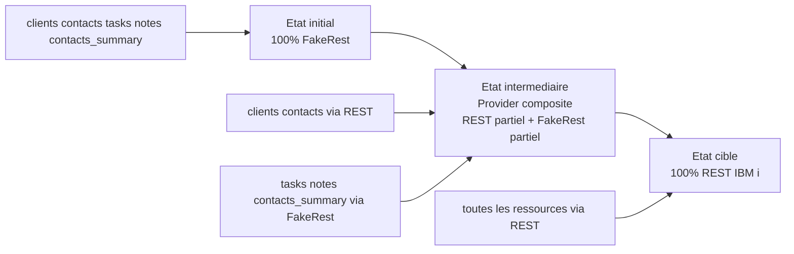

# How-to: migrer de FakeRest vers un data provider REST IBM i

Ce guide decrit une migration progressive pour remplacer `ra-data-fakerest` par un provider REST reel, sans casser les ecrans existants.

## Objectif

Conserver:

- les composants List/Edit/Create
- les objets `ResourceProps`
- la composition dans `src/app/App.tsx`

Ne remplacer que:

- `src/app/providers/dataProvider.ts`

## 1. Stabiliser le contrat de donnees

Avant migration, verifier que les noms de champs affiches dans les ecrans correspondent au futur contrat API.

Exemples actuels:

- `contacts.client_id`
- `tasks.contact_id`
- `contacts_summary.open_tasks`

Si le backend IBM i renvoie des noms differents, prevoir une couche de mapping dans le provider.

## 2. Poser un provider REST de base

Option simple: utiliser un provider REST existant comme base, puis l'adapter.

Exemple conceptuel dans `src/app/providers/dataProvider.ts`:

```ts
// Exemple de structure: adapter selon le provider choisi
import simpleRestProvider from 'ra-data-simple-rest';

const apiUrl = import.meta.env.VITE_API_URL;
const baseProvider = simpleRestProvider(apiUrl);

const dataProvider = {
  ...baseProvider,
  // Surcharges ponctuelles possibles ici
};

export default dataProvider;
```

Important: ce package n'est pas installe actuellement. L'exemple montre la direction de migration.

## 3. Gerer les particularites IBM i

Les APIs IBM i peuvent avoir:

- des cles primaires non standard
- des enveloppes de reponse (`{ data, total }` ou autre)
- des filtres/tri/pagination differents

Adapter ces ecarts dans des methodes surchargees (`getList`, `getOne`, `update`, etc.).

Exemple de surcharge simplifiee:

```ts
const dataProvider = {
  ...baseProvider,
  async getList(resource, params) {
    const result = await baseProvider.getList(resource, params);

    // Exemple: normaliser une cle backend vers id
    return {
      ...result,
      data: result.data.map((row: any) => ({
        ...row,
        id: row.id ?? row.ID,
      })),
    };
  },
};
```

## 4. Traiter les ressources de projection

Pour `*_summary` (ex: `contacts_summary`), 2 strategies:

1. Calcul cote backend IBM i (recommande en production)
2. Calcul cote frontend temporaire (transitoire)

Recommandation:

- exposer des endpoints dedies (`/contacts_summary`, `/deals_summary`)
- garder le meme nom de ressource cote admin pour eviter les changements UI

## 5. Basculer progressivement

Approche conseillee:

1. migrer `clients`
2. migrer `contacts`
3. migrer `tasks` et `notes`
4. migrer `contacts_summary`

Pendant la transition, tu peux router certaines ressources vers FakeRest et d'autres vers REST via un provider composite.

## 6. Schema de migration (vue rapide)



## 7. Provider composite (migration douce)

Exemple de principe:

```ts
const restResources = new Set(['clients', 'contacts']);

const dataProvider = {
  async getList(resource: string, params: any) {
    return restResources.has(resource)
      ? restProvider.getList(resource, params)
      : fakeProvider.getList(resource, params);
  },
  // meme logique pour getOne, create, update, delete...
};
```

## 8. Validation de migration

Checklist:

- les listes chargent avec tri/pagination
- les formulaires create/edit sauvegardent
- `id` est toujours present
- les ressources `*_summary` renvoient les champs attendus
- aucun changement requis dans `src/modules/crm/*` hors cas specifiques

## 9. Variables d'environnement

Ajouter une variable d'URL API:

```bash
VITE_API_URL=https://mon-api-ibmi.exemple.com
```

Puis lire cette valeur dans `dataProvider.ts`.

## 10. Definition de done

Migration terminee quand:

- `ra-data-fakerest` n'est plus utilise en production
- toutes les ressources passent par le provider REST
- les ecrans CRUD et les vues `*_summary` conservent le meme comportement fonctionnel
