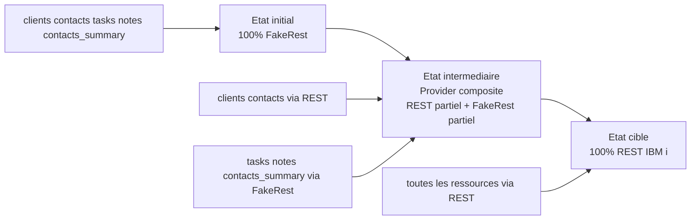

# How-to: migrer de FakeRest vers un data provider REST IBM i

Ce guide decrit une migration progressive pour remplacer `ra-data-fakerest` par un provider REST reel, sans casser les ecrans existants.

## Objectif

Conserver:

- les composants List/Edit/Create
- les objets `ResourceProps`
- la composition dans `src/app/App.tsx`

Ne remplacer que:

- `src/app/providers/dataProvider.ts`

## 1. Stabiliser le contrat de donnees

Le contrat retenu pour ce projet est détaillé dans
[`contrat-data-provider-ibmi.md`](./contrat-data-provider-ibmi.md) et reflété par le registre
typé `src/app/providers/resourceContracts.ts`. Toute évolution d'un écran consommant un
nouveau champ, filtre ou tri doit mettre à jour ce registre. Le présent guide ne change
que si cette évolution modifie également un invariant de transport.

Avant migration, verifier que les noms de champs affiches dans les ecrans correspondent au futur contrat API.

Exemples actuels:

- `contacts.client_id`
- `tasks.contact_id`
- `contacts_summary.open_tasks`

Si le backend IBM i renvoie des noms differents, prevoir une couche de mapping dans le provider.

Formaliser pour chaque ressource :

- identifiant et représentation ;
- champs obligatoires, valeurs nulles et formats de date/décimaux ;
- relations ;
- filtres, tri et pagination ;
- capacités autorisées : lecture, création, modification, suppression ou action métier ;
- format des erreurs fonctionnelles.

## 2. Poser un provider REST de base

Option simple: utiliser un provider REST existant comme base, puis l'adapter.

Exemple conceptuel dans `src/app/providers/dataProvider.ts`:

```ts
// Exemple de structure: adapter selon le provider choisi
import simpleRestProvider from 'ra-data-simple-rest';

const apiUrl = import.meta.env.VITE_API_URL;
const baseProvider = simpleRestProvider(apiUrl);

const dataProvider = {
  ...baseProvider,
  // Surcharges ponctuelles possibles ici
};

export default dataProvider;
```

Important: ce package n'est pas installe actuellement. L'exemple montre la direction de migration.

## 3. Gerer les particularites IBM i

Les APIs IBM i peuvent avoir:

- des cles primaires non standard
- des enveloppes de reponse (`{ data, total }` ou autre)
- des filtres/tri/pagination differents

Adapter ces ecarts dans des methodes surchargees (`getList`, `getOne`, `update`, etc.).

Points à traiter explicitement :

- conversion des dates sans décalage de fuseau involontaire ;
- décimaux monétaires sans perte de précision ;
- normalisation UTF-8 des textes provenant de l'IBM i ;
- concurrence et version d'enregistrement ;
- authentification, autorisations et expiration de session ;
- annulation des requêtes lorsque le provider la supporte.

Exemple de surcharge simplifiee:

```ts
const dataProvider = {
  ...baseProvider,
  async getList(resource, params) {
    const result = await baseProvider.getList(resource, params);

    // Exemple: normaliser une cle backend vers id
    return {
      ...result,
      data: result.data.map((row: any) => ({
        ...row,
        id: row.id ?? row.ID,
      })),
    };
  },
};
```

## 4. Traiter les ressources de projection

Pour `*_summary` (ex: `contacts_summary`), 2 strategies:

1. Calcul cote backend IBM i (recommande en production)
2. Calcul cote frontend temporaire (transitoire)

Recommandation:

- exposer des endpoints dedies (`/contacts_summary`, `/deals_summary`)
- garder le meme nom de ressource cote admin pour eviter les changements UI

## 5. Basculer progressivement

Approche conseillee:

1. migrer `clients`
2. migrer `contacts`
3. migrer `tasks` et `notes`
4. migrer `contacts_summary`

Pendant la transition, tu peux router certaines ressources vers FakeRest et d'autres vers REST via un provider composite.

## 6. Schema de migration (vue rapide)


```mermaid
flowchart LR
  A[Etat initial\n100% FakeRest] --> B[Etat intermediaire\nProvider composite\nREST partiel + FakeRest partiel]
  B --> C[Etat cible\n100% REST IBM i]

  A1[clients contacts tasks notes contacts_summary] --> A
  B1[clients contacts via REST] --> B
  B2[tasks notes contacts_summary via FakeRest] --> B
  C1[toutes les ressources via REST] --> C
```

## 7. Provider composite (migration douce)

Exemple de principe:

```ts
const restResources = new Set(['clients', 'contacts']);

const dataProvider = {
  async getList(resource: string, params: any) {
    return restResources.has(resource)
      ? restProvider.getList(resource, params)
      : fakeProvider.getList(resource, params);
  },
  // meme logique pour getOne, create, update, delete...
};
```

Cet extrait est un pseudo-code incomplet. Le provider composite réel doit router toutes
les méthodes du contrat utilisées par l'application, conserver les signaux d'annulation
et présenter les mêmes formes de résultats et d'erreurs pour les deux sources.

### Première verticale active : `services`

La première bascule effective conserve FakeRest comme source par défaut et route uniquement
la ressource technique `services` vers
[`iwsDataProvider.ts`](../../src/app/providers/iwsDataProvider.ts). Cette ressource correspond
exactement à l'entité CMagic `Service` adossée à `DB2SAMPLE.DEPARTMENT` ; elle ne doit pas
être confondue avec les clients du CRM.

Le périmètre frontend est volontairement limité à :

- `getList`, qui transmet `page`, `perPage`, `sort`, `order`, `q` et les filtres puis
  transforme `{ items, totalCount, errors }` en `{ data, total }` ;
- `getOne`, qui appelle `/{id}` puis transforme `{ item, errors }` en `{ data }` ;
- la conservation de l'identifiant naturel `id` fourni par IBM i ;
- la conversion des statuts `400`, `401`, `403`, `404`, `409` et `500` en `HttpError` ;
- le transfert de l'`AbortSignal` lorsque l'appelant le fournit.

Les autres ressources et les projections restent sur leur chemin FakeRest actuel. Les
mutations de `services` ne sont pas exposées et aucun écran CRM n'est ajouté pour cette
ressource technique.

## 8. Validation de migration

Checklist:

- les listes chargent avec tri/pagination
- les formulaires create/edit sauvegardent
- `id` est toujours present
- les ressources `*_summary` renvoient les champs attendus
- aucun changement requis dans `src/modules/crm/*` hors cas specifiques
- les erreurs 400, 401, 403, 404, 409 et 500 ont un comportement défini
- les dates et montants sont restitués sans perte
- les tests de contrat passent contre un environnement IBM i contrôlé

## 9. Actions métier et processus

Une transition métier ne doit pas être simulée en production par la seule mise à jour
libre d'un champ `status`. Pour une action telle que confirmer ou annuler :

- exposer un endpoint explicite ;
- vérifier les préconditions côté backend ;
- définir l'idempotence ;
- retourner l'état résultant et une erreur métier exploitable ;
- tracer l'utilisateur et la corrélation de l'opération.

Une extension typée du provider ou un client métier dédié peut porter ces appels. La
méthode `customAction` n'appartient pas au contrat DataProvider standard.

## 10. Variables d'environnement

La verticale IWS utilise l'URL publique de la ressource complète :

```bash
VITE_IBM_I_API_URL=/web/services/SERVIWS3
```

La valeur relative ci-dessus utilise la même origine que l'application déployée. Une URL
publique absolue peut être fournie pour un autre environnement. Le fichier
[`.env.example`](../../.env.example) documente la variable sans imposer d'hôte local.

Dans un intranet où le port applicatif est bloqué, le serveur HTTP IBM i peut publier un
chemin accessible et le relayer vers le service interne. La configuration
[`httpd.conf`](../../projets_annexes/applicationTemplate/ressources/conf/httpd.conf) fournit
un exemple fonctionnel de `ProxyPass` pour une API ILEastic. Le principe de proxy est
réutilisable, mais sa cible `/api` sur le port `44000` ne constitue pas l'URL du service IWS
`SERVIWS3` et ne doit pas être recopiée sans adaptation par l'équipe IBM i.

Ne pas versionner de secret dans une variable `VITE_*` : ces variables sont intégrées au
bundle client. L'URL publique de l'API peut y figurer, mais pas un jeton ou mot de passe.

## 11. Strategie de bascule

- migrer une tranche verticale et la comparer à FakeRest ;
- journaliser les erreurs et temps de réponse ;
- prévoir un retour vers le provider précédent ;
- ne retirer les données locales qu'après recette complète ;
- documenter la version du contrat backend compatible.

## 12. Definition de done

Migration terminee quand:

- `ra-data-fakerest` n'est plus utilise en production
- toutes les ressources passent par le provider REST
- les ecrans CRUD et les vues `*_summary` conservent le meme comportement fonctionnel
- l'authentification et les autorisations sont validées
- les tests de contrat et la recette de non-régression sont verts
- la stratégie de retour arrière a été testée
